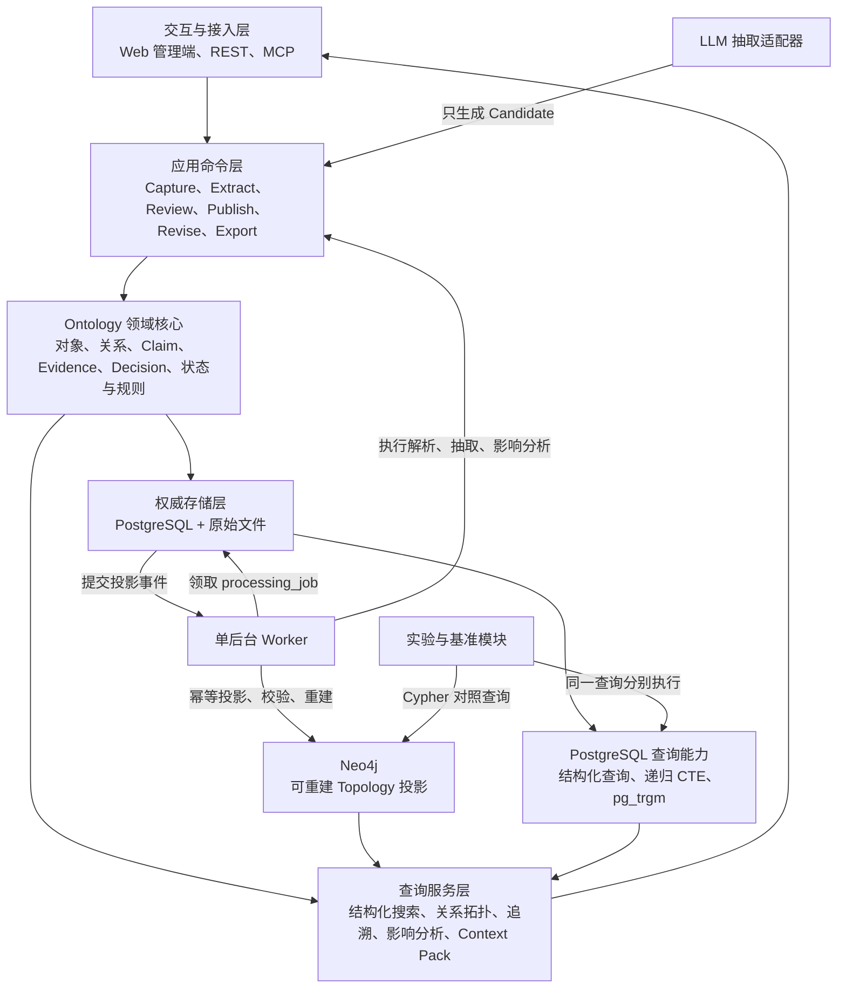
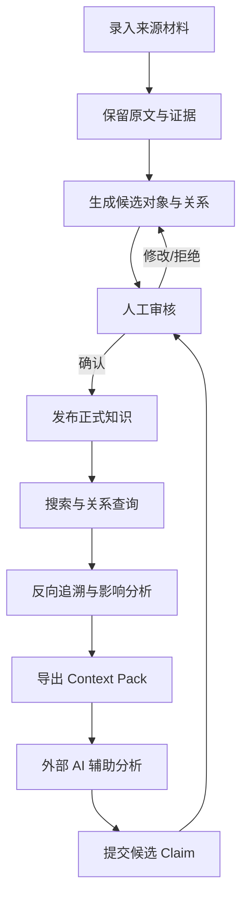
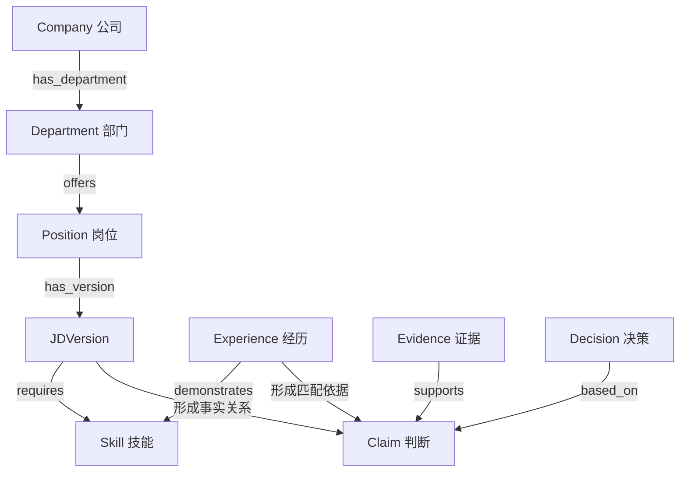
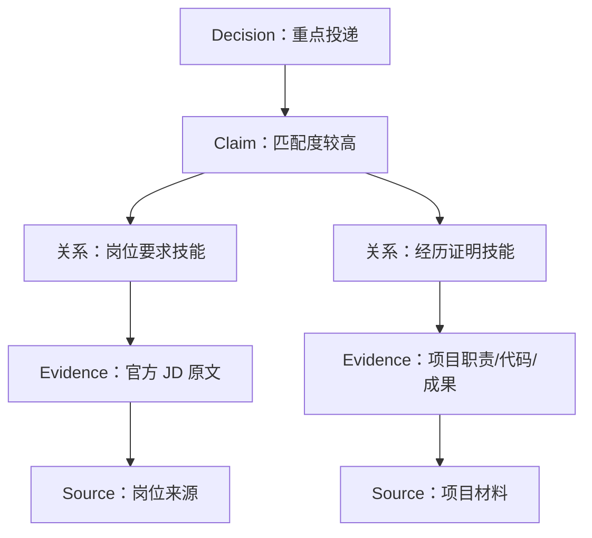
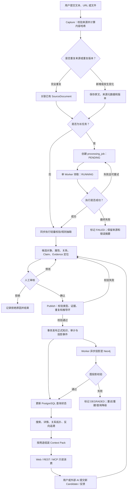
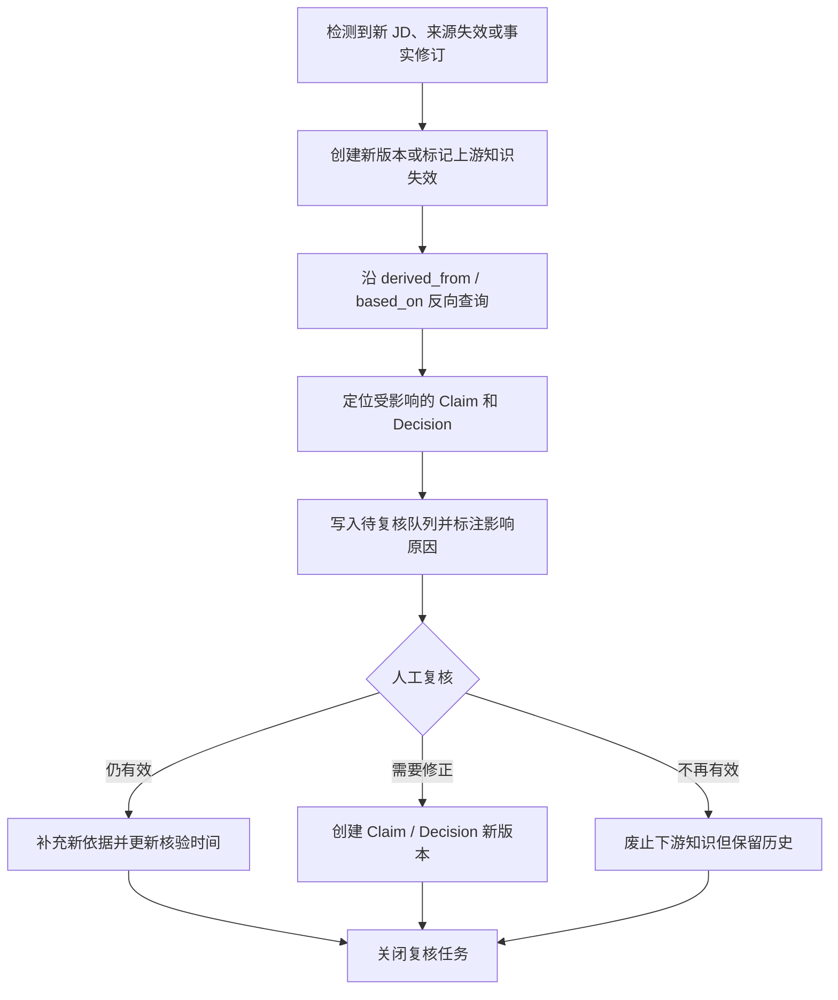
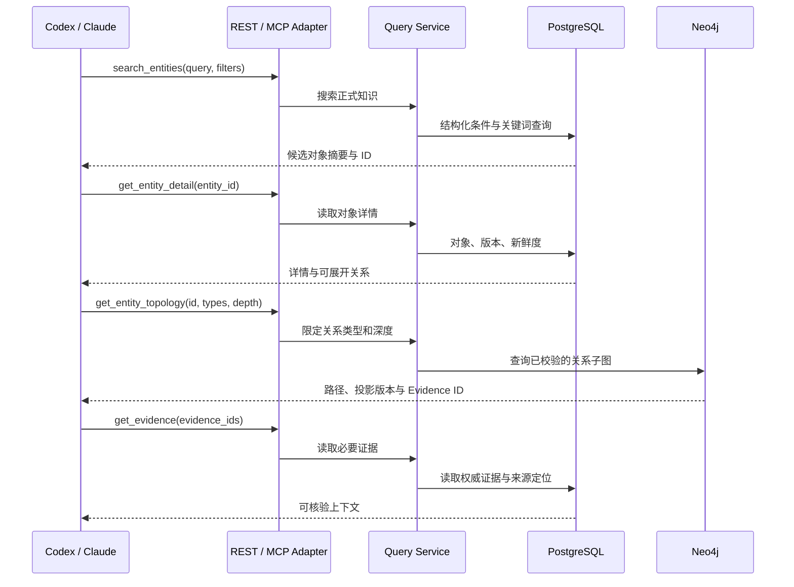
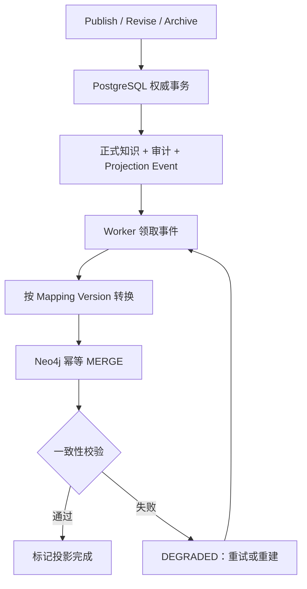
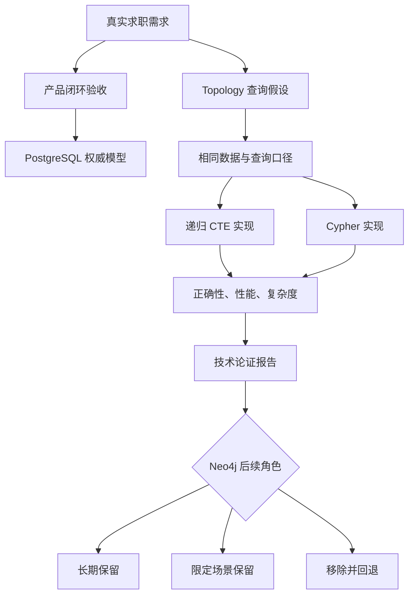
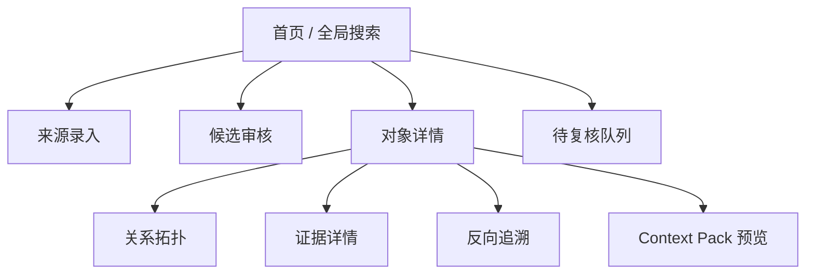

# 个人知识关系系统（P0：求职域）PRD

## 1. 文档信息

### 1.1 基本信息（名称、版本、作者、日期）

| 项目 | 内容 |
|---|---|
| 产品名称 | 个人知识关系系统 |
| 本期范围 | P0：求职知识域 |
| 文档版本 | v0.4.0 |
| 文档状态 | 讨论稿 |
| 作者 | Zayn / ChatGPT（协作整理） |
| 创建日期 | 2026-07-28 |
| 目标读者 | 产品设计者、开发者、测试者、后续 AI Agent / MCP 接入方 |
| 预计周期 | P0 约 3～5 周；产品闭环优先，技术实验可按里程碑独立验收 |

### 1.2 变更记录

| 版本 | 日期 | 变更人 | 变更内容 |
|---|---|---|---|
| v0.1.0 | 2026-07-28 | Zayn / ChatGPT | 首次形成完整 PRD；明确以求职域验证个人知识关系系统；确立“关系、证据、推导、反向核验”为核心 |
| v0.2.0 | 2026-07-28 | Zayn / ChatGPT | 增加 P0 技术架构选型、组件职责与演进策略；补充系统逻辑架构图、端到端处理流程和上游变更影响流程 |
| v0.3.0 | 2026-07-28 | Zayn / ChatGPT | 权威数据库由 MySQL 调整为 PostgreSQL；明确 P0 不引入 Redis 和消息队列；补充基于 `processing_job` 表与单后台 Worker 的长任务处理方案 |
| v0.4.0 | 2026-07-28 | Zayn / ChatGPT | 将项目明确为“产品交付 + 技术论证”双目标；P0 正式引入 Neo4j 可重建图投影；增加拓扑查询、PostgreSQL/Cypher 对照实验、投影同步与重建机制及实验验收指标 |

### 1.3 术语表

| 术语 | 定义 |
|---|---|
| 知识对象（Knowledge Object） | 系统中具有稳定身份、属性和生命周期的业务实体，如公司、部门、岗位、技能、个人经历 |
| 关系（Relation） | 两个知识对象之间具有明确语义的连接，如“岗位要求技能”“经历证明技能” |
| 事实关系（Fact Relation） | 可以直接由可信来源核验的关系，如官方 JD 明确写明岗位要求 Python |
| 来源陈述（Source-reported Claim） | 某个来源表达的说法，但系统不将其直接等同于客观事实，如员工评价“部门加班较多” |
| 主张（Claim） | 对某个对象、关系或问题作出的明确陈述，可为事实陈述、来源转述、分析推断或个人判断 |
| 证据（Evidence） | 支持、反驳或限定某条关系或主张的原始材料片段及其定位信息 |
| 来源材料（Source Document） | JD、公司官网、招聘网页、PDF、项目文档、个人笔记等原始资料 |
| 推导关系（Derived Relation） | 由一个或多个上游事实、关系或主张推导出的关系，不应伪装成直接事实 |
| 决策（Decision） | 用户基于事实与判断形成的行动选择，如重点投递、普通投递、暂缓、放弃 |
| 候选知识（Candidate） | 由人工或模型新建、尚未核验的对象、属性、关系或主张 |
| 正式知识（Published Knowledge） | 经人工确认后，可被检索、导出和外部 AI 消费的知识 |
| 反向追溯（Reverse Trace） | 从判断或决策出发，沿 `based_on / derived_from / supported_by` 等关系回到原始事实和证据 |
| 影响分析（Impact Analysis） | 当上游事实失效或变化时，定位可能受影响的下游主张和决策 |
| 新鲜度（Freshness） | 知识最后采集、核验和有效性状态的信息 |
| 渐进式披露（Progressive Disclosure） | 外部 AI 先搜索对象，再读取详情、关系和证据，按需扩展上下文，而不是一次加载全部资料 |
| Context Pack | 面向某个任务组装的结构化上下文包，明确区分事实、关系、证据、推断、缺失信息和新鲜度 |
| Ontology | 本系统中用于定义知识对象、属性、关系、状态与允许操作的业务语义模型，不等同于单纯知识图谱 |
| Topology | 对象与关系连接后形成的网络结构，包括路径、邻域、子图、依赖方向和影响范围 |
| 图投影（Graph Projection） | 从 PostgreSQL 已发布知识生成的 Neo4j 查询副本；可延迟、可校验、可重建，不承担正式知识的权威写入 |
| 技术论证实验 | 在真实产品闭环中，对 PostgreSQL 递归查询、Neo4j Cypher、图投影同步和拓扑消费价值进行可复现的对照验证 |
| MCP | 向 Codex、Claude 等外部 AI 暴露标准工具能力的适配层；不是知识存储底座 |

---

## 2. 需求背景与目标

### 2.1 问题陈述（现状/证据 → 影响/代价 → 时机/约束）

#### 2.1.1 现状与证据

当前求职相关知识分散在多个位置：

- 招聘官网、招聘平台和搜索结果中的公司、部门、岗位及 JD；
- 与 AI 对话中形成的岗位分析、公司评价和投递建议；
- 简历、项目文档、代码、实习记录中的个人能力证据；
- 个人笔记中记录的岗位偏好、判断标准和结论；
- 同一公司、岗位或技能在不同时间、不同来源下存在多种说法。

现有文件夹、笔记或聊天记录主要以“材料”为中心，能够保存内容，但难以稳定回答以下问题：

- 某个岗位当前要求哪些核心能力，依据是哪一版 JD；
- 某项个人经历具体证明了哪些能力，证据位于什么文档或代码；
- “值得投递”“匹配度较高”等判断由哪些事实推导而来；
- 某条公司评价是官方事实、员工个人体验，还是 AI 的推测；
- 上游信息变化后，哪些既有判断和投递决策需要重新检查；
- 外部 AI 如何只获取当前任务所需的可靠上下文，而不必重新阅读所有资料。

#### 2.1.2 影响与代价

如果只继续积累原始材料或聊天结论，将产生以下代价：

- 相同信息被反复搜索、阅读和解释；
- AI 容易把官方事实、第三方评价和自己的判断混在一起；
- 结论与原始证据脱节，时间久后无法判断当时为什么作出该结论；
- 岗位 JD 更新后，旧结论仍可能被继续使用；
- 项目经历与岗位要求之间的证明关系依赖临时记忆，难以复用；
- 资料越多，上下文越难选择，向外部 AI 提供的信息反而更不可控。

#### 2.1.3 时机与约束

当前处于秋招准备和岗位筛选阶段，求职资料会持续增加，适合选取真实需求作为个人知识系统的首个领域。

本期约束如下：

- 仅服务单个用户，不建设商业化多租户平台；
- 开发时间有限，但本项目同时承担产品验证与技术学习任务；允许为明确的论证问题引入必要组件，不做无目的的技术堆叠；
- 系统不需要“知道所有东西”，但必须支持人沿关系链核验关键判断；
- AI 可以辅助抽取候选知识，但不能直接发布为已确认事实；
- 第一阶段以结构化查询和关系查询为主，向量检索仅作为后续补充；
- 个人经历、求职偏好和未公开项目资料具有隐私性，必须限制外部访问。

除求职产品需求外，本次实验还需要回答以下工程问题：

- PostgreSQL 邻接表与递归 CTE 是否足以支撑证据链、推导链和影响分析；
- Neo4j 的图模型与 Cypher 是否能降低多跳路径、邻域和子图查询的表达复杂度；
- 图投影能否在不破坏权威数据一致性的前提下，为关系浏览和外部 AI 提供更合适的拓扑上下文；
- PostgreSQL 与 Neo4j 的混合架构增加了多少同步、运维和测试成本，该成本是否值得。

### 2.2 产品目标

#### 2.2.1 一句话定位

> 第一阶段面向求职场景，建立一个以对象关系、证据来源和推导链为核心的个人知识系统；同时以真实业务链路验证 Ontology 建模、PostgreSQL 与 Neo4j 混合存储、关系拓扑查询及 MCP 上下文服务的工程适用性。

#### 2.2.2 核心目标

1. **建立求职知识对象体系**
   - 对公司、部门、岗位、JD 版本、技能、个人经历、主张、证据和决策进行统一建模。

2. **管理有业务语义的关系**
   - 使用“岗位要求技能”“经历证明技能”等明确关系，而不是大量模糊的 `related_to`。

3. **支持结论反向核验**
   - 从“重点投递某岗位”等决策出发，能够反向追溯到匹配判断、岗位要求、个人经历和原始证据。

4. **区分事实、来源陈述、推导和决策**
   - 系统不得把第三方评价、AI 分析或个人判断伪装成客观事实。

5. **支持知识修正与影响定位**
   - 上游信息变化、过期或被否定时，能够定位受影响的下游判断和决策。

6. **向外部 AI 提供受控上下文**
   - 通过 REST API 和后续只读 MCP 工具，按“搜索—详情—关系—证据”的顺序渐进披露知识。

#### 2.2.3 技术实验目标

1. **建立可重建图投影**
   - PostgreSQL 保存权威对象、关系、版本、状态和审计；Neo4j 保存已发布知识的图查询投影。

2. **验证真实 Topology 用例**
   - 完成证据反向追溯、多跳技能匹配、上游变更影响分析和限定子图导出四类查询。

3. **形成数据库对照结论**
   - 选取相同查询分别使用 PostgreSQL 递归 CTE 与 Neo4j Cypher 实现，比较表达复杂度、性能、环路处理、可解释性和维护成本。

4. **验证投影可靠性**
   - 支持增量投影、幂等重试、差异校验、失败恢复和全量重建。

5. **沉淀可复现成果**
   - 输出图模型映射、Cypher 查询样例、基准测试数据和 Neo4j 适用性结论。

#### 2.2.4 产品与实验原则

- **关系优先于材料堆积**：材料是来源，关系链才是主要消费形态。
- **可追溯优先于自动回答**：系统保证依据可查，不承诺自动结论绝对正确。
- **人工确认优先于自动发布**：模型只能生成候选知识。
- **显式语义优先于模糊关联**：关系必须表达业务含义。
- **版本保留优先于覆盖更新**：新 JD、新结论和新证据不得直接抹除旧版本。
- **渐进查询优先于一次性加载**：避免将全部资料直接塞给外部 AI。
- **底座与 Agent 解耦**：知识系统提供事实和上下文，外部 Agent 负责分析与生成。
- **权威数据与查询投影分离**：PostgreSQL 决定正式知识状态，Neo4j 不接受独立业务写入。
- **实验问题先于技术组件**：每个新增组件必须对应明确假设、对照方案、度量指标和退出条件。
- **允许最终结论是否定选型**：即使实验后决定不长期保留 Neo4j，只要形成了可复现证据，技术实验仍视为成功。

### 2.3 成功指标（业务指标 + 交付指标）

#### 2.3.1 业务指标

| 指标 | 定义 | P0 目标 |
|---|---|---|
| 关键关系证据覆盖率 | `Position requires Skill`、`Experience demonstrates Skill`、`Claim derived_from`、`Decision based_on` 等关键关系中，具有可定位证据或明确推导依据的比例 | 100% |
| 决策可追溯率 | 抽样投递决策能够完整回溯到上游主张、事实和证据的比例 | 100%，抽样不少于 5 个决策 |
| 事实与判断区分率 | 抽样知识中能够正确标明直接事实、来源陈述、推导判断、个人决策的比例 | 100%，抽样不少于 50 条 |
| 关系链完整率 | 核心岗位是否具备“岗位→技能→经历→证据”完整链路 | 不低于 90%，抽样不少于 10 个岗位 |
| 变更影响识别率 | 构造上游 JD 失效、技能要求变化等测试场景后，系统能识别受影响下游主张和决策的比例 | 不低于 90% |
| 外部 AI 可消费率 | 外部 AI 仅通过 Context Pack / API 即可完成岗位分析，不需要直接读取数据库或手工拼接全部材料 | 5 个验收任务全部完成 |
| 检索有效性 | 用户在不超过“搜索→详情→关系展开”三个主要操作内找到目标证据 | 不低于 80%，抽样不少于 10 个任务 |

> 注：P0 的核心不是追求大规模知识数量，而是验证关系链质量。数量指标仅用于形成足够的真实测试集。

#### 2.3.2 交付指标

| 指标 | P0 目标 |
|---|---|
| 公司数据 | 不少于 10 家 |
| 岗位数据 | 不少于 20 个真实岗位 |
| JD 版本 | 每个岗位至少 1 个；至少 3 个岗位具备 2 个及以上版本 |
| 标准技能 | 不少于 25 个 |
| 个人经历 | 不少于 3 项真实项目或实习经历 |
| 正式语义关系 | 不少于 50 条，不含纯标签关系 |
| 可定位证据 | 不少于 50 条 |
| Context Pack | 支持 JSON、Markdown 两种格式 |
| 查询接口 | 完成对象搜索、对象详情、关系子图、证据查询、反向追溯、Context Pack 导出 |
| 质量门槛 | 阻断级和严重级缺陷为 0；核心验收用例通过率 100% |

#### 2.3.3 技术实验指标

| 指标 | P0 目标 |
|---|---|
| 图模型映射 | 完成 PostgreSQL 核心对象/关系到 Neo4j 节点/边的版本化映射说明 |
| Topology 查询 | 完成证据反向追溯、多跳技能匹配、变更影响分析、Context 子图导出 4 类真实查询 |
| 双方案对照 | 至少 2 类核心查询同时实现 PostgreSQL 递归 CTE 与 Neo4j Cypher 版本 |
| 测试数据集 | 使用不少于 1,000 个对象、5,000 条关系的可重复生成数据集，并保留真实小样本验收集 |
| 基准轮次 | 每个对照查询完成预热后不少于 30 次执行，记录 P50、P95、最大值与返回规模 |
| 投影成功率 | 已提交投影任务最终成功率 100%；失败可安全重试且不产生重复节点或关系 |
| 投影一致性 | 对已发布知识进行抽样/全量校验时，对象与关系计数、版本和状态一致率 100% |
| 全量重建 | 清空 Neo4j 后可仅依赖 PostgreSQL 和原始映射配置重建完整图投影 |
| 实验结论 | 输出一份包含适用场景、收益、成本、局限和去留建议的技术论证报告 |

---

## 3. 范围

### 3.1 本期范围（Must / Should）

#### 3.1.1 Must：P0 必须完成

| 能力 | 说明 |
|---|---|
| 来源材料录入 | 支持粘贴文本、录入网页 URL 及来源元数据；保存原始内容或用户提供的原文 |
| 原始证据保留 | 保存证据摘录、来源、定位信息、采集时间和内容指纹 |
| 核心知识对象 | Company、Department、Position、JDVersion、Skill、Experience、SourceDocument、Evidence、Claim、Decision |
| 候选知识区 | 新对象、属性、关系和主张先进入 Candidate 状态 |
| 人工审核发布 | 支持确认、修改、合并、拒绝候选知识 |
| 关系管理 | 支持创建、查看、修改、废止具有明确语义的关系 |
| 事实与推导区分 | 每条关键关系或主张标记认识类型和形成依据 |
| 版本管理 | 同一岗位的新 JD 创建新版本，不覆盖旧版本 |
| 新鲜度管理 | 记录采集时间、最后核验时间、当前有效状态 |
| 结构化筛选 | 按公司、城市、岗位方向、技能、发布时间、状态等筛选 |
| 关键词检索 | 对对象名称、别名、摘要和来源内容进行关键词搜索 |
| 关系查询 | 支持从对象出发进行一跳、二跳关系展开 |
| Neo4j 图投影 | 将 PostgreSQL 中已发布的对象和关系增量投影至 Neo4j，禁止独立业务写入 |
| Topology 查询 | 支持路径追溯、邻域展开、影响范围和限定子图导出 |
| 图投影恢复 | 支持投影任务幂等重试、差异校验及从 PostgreSQL 全量重建 |
| 反向追溯 | 从 Claim 或 Decision 回溯到上游关系、证据和来源 |
| 影响分析 | 上游对象、关系或证据失效时，列出可能受影响的 Claim 和 Decision |
| Context Pack | 针对岗位或决策导出结构化上下文，区分事实、推断、证据和缺失信息 |
| 只读 REST API | 外部系统可通过标准接口查询正式知识 |
| 审计记录 | 记录关键知识的创建、确认、修改、废止和恢复 |
| PostgreSQL / Neo4j 对照实验 | 至少对两类核心拓扑查询实现递归 CTE 与 Cypher 版本，并记录可复现测试结果 |
| 技术论证报告 | 汇总图建模、查询表达、性能、同步成本、适用边界与 Neo4j 去留建议 |

#### 3.1.2 Should：P0 可争取完成

| 能力 | 说明 |
|---|---|
| PDF 导入 | 上传 PDF，保留文件并抽取可检索文本 |
| AI 辅助抽取 | 从 JD 或项目材料中提取候选对象、技能、关系和证据片段 |
| 技能同义词归一 | 将 `Lang Graph`、`LangGraph` 等映射到同一标准技能 |
| 冲突检测 | 发现同一主题下互相冲突的 Claim 并提示人工处理 |
| 高级关系图交互 | 在基础拓扑展示上支持路径高亮、折叠、按认识类型过滤和节点上限提示 |
| 只读 MCP 适配 | 将稳定 REST 能力包装为 Codex / Claude 可调用的 MCP 工具 |
| Context Pack 模板 | 支持“岗位分析”“经历匹配”“投递决策复核”等不同目的 |
| 批量导入 | 通过 CSV / JSON 导入已有岗位、技能和关系 |

### 3.2 非本期范围（Won't）

P0 明确不实现以下能力：

- 全网自动发现、持续爬取全部招聘岗位；
- 自动投递简历、自动发送消息或自动操作招聘网站；
- 在系统内部完成最终职业决策并替用户执行；
- 允许外部 AI 直接新增、修改或删除正式知识；
- 多用户协作、复杂权限、组织空间和商业化 SaaS；
- 通用 Ontology 可视化编辑器；
- 覆盖学习、健康、生活、社交等所有个人知识域；
- 复杂推荐算法和自动岗位排名；
- 将聊天记录全部自动沉淀为正式知识；
- 将 Neo4j 作为正式知识的权威写入源，或允许绕过 PostgreSQL 直接修改图投影；
- 为追求技术复杂度而引入没有验证假设的向量数据库、规则引擎等组件；
- 对所有原始文档进行无差别切片并构建纯 RAG 问答系统；
- A2A、多 Agent 自动协作和自主任务执行；
- 与招聘平台实时同步岗位状态；
- 自动判断第三方评价的客观真实性；
- 绩效分析、员工画像等高敏感用途。

### 3.3 关键假设与风险

| 编号 | 假设或风险 | 可能影响 | 应对策略 |
|---|---|---|---|
| R-01 | 人工维护关系的成本高于普通笔记 | 用户放弃持续录入 | 只要求关键关系有证据；支持模板、复用、候选抽取和批量确认 |
| R-02 | AI 抽取可能产生错误对象或关系 | 错误知识进入正式区 | Candidate 与 Published 物理或逻辑隔离；发布必须人工确认 |
| R-03 | 同一公司或岗位存在别名、重复记录 | 关系链断裂或重复 | 唯一标识、别名表、合并机制和重复检测 |
| R-04 | 第三方评价天然主观且可能冲突 | 用户误将评价当成事实 | 建模为 Source-reported Claim；保留来源、范围和冲突关系 |
| R-05 | 岗位页面下线或内容变化 | 无法回到原始证据 | 保存证据摘录、采集时间、内容指纹和必要的原文快照 |
| R-06 | 关系类型过多或过于抽象 | 模型难维护、难查询 | P0 使用受控关系字典；新增关系类型需说明消费场景 |
| R-07 | Neo4j 实验侵占产品闭环开发时间 | 核心求职场景延期或不可用 | 双轨里程碑；先保证权威写入与基本追溯，再启用图投影；Neo4j 故障不得阻断正式知识发布 |
| R-08 | 关系链存在循环推导 | 反向追溯无法终止 | 普通业务关系允许成环；`derived_from` 推导链必须无环 |
| R-09 | 上游信息变更后，下游结论未更新 | 过期判断继续影响决策 | 新鲜度状态、影响分析、待复核队列 |
| R-10 | 个人项目材料包含隐私或公司敏感信息 | 信息泄露 | 数据分级、默认私有、导出脱敏、外部接口只读并限制字段 |
| R-11 | Context Pack 过大 | 外部 AI 上下文浪费、重点不清 | 按目的、关系类型、深度、时间和证据数量进行裁剪 |
| R-12 | 用户将“有证据”误解为“结论一定正确” | 产生过度信任 | UI 明确展示认识类型、来源等级、争议状态和缺失信息 |
| R-13 | PostgreSQL 与 Neo4j 投影短暂不一致 | 查询返回过期或缺失拓扑 | PostgreSQL 为权威源；记录投影版本和延迟；提供重试、校验、全量重建及查询降级 |
| R-14 | 小数据集基准无法代表真实规模 | 得出错误技术结论 | 同时使用真实小样本和可重复合成数据；记录规模、深度、返回节点数和测试环境 |
| R-15 | 只比较延迟而忽略维护复杂度 | 选型结论片面 | 同时评估查询代码量、可读性、环路控制、模型变更、同步与运维成本 |

### 3.4 系统责任边界与架构约束

1. **正式知识的权威来源**
   - 对象、关系、证据、版本和状态构成正式知识源。
   - PostgreSQL 是 P0 唯一权威数据库。
   - Neo4j 是 P0 正式引入但可重建的图查询投影，不是第二个业务真相来源。

2. **写入边界**
   - 用户管理端可通过受控操作创建和审核知识。
   - 外部 AI 在 P0 只能读取正式知识和提交候选建议，不能直接修改正式知识。

3. **服务边界**
   - 先定义普通 Service / REST 契约，再包装为 MCP 工具。
   - Web 页面、Codex、Claude 等消费同一套底层知识模型。

4. **检索边界**
   - 结构化筛选和显式关系查询为 P0 主路径。
   - 关键词检索用于发现对象和原文。
   - PostgreSQL 提供基础关系查询和降级能力；Neo4j 负责实验性多跳路径、邻域、子图和影响范围查询。
   - 向量检索只用于未结构化材料或语义召回补充，不能替代正式关系。

5. **正确性边界**
   - 系统保证“可查看依据和形成过程”，不保证每条来源或推导天然正确。
   - 最终求职判断和行动由用户负责。

6. **技术实验边界**
   - 技术方案必须围绕真实产品查询进行验证，不单独制作与业务脱节的图数据库 Demo。
   - Neo4j 不参与 `publish` 事务；投影采用最终一致性。
   - 图投影不可用时，正式知识写入、审核和基础查询仍应可运行。

### 3.5 P0 技术架构选型

#### 3.5.1 总体架构策略

P0 采用“**模块化单体 + PostgreSQL 权威源 + Neo4j 可重建图投影 + 可替换适配器**”架构。

选择这一架构的原因：

- 当前仅服务单个用户，业务复杂度主要来自知识语义和关系链，而不是并发量；
- 对象、关系、证据、版本和审计需要在同一事务中保持一致；
- 前期需要频繁调整 Ontology 模型，单体架构比微服务更容易重构和调试；
- REST、MCP、AI 抽取、文件存储均通过适配层隔离，后续可以独立替换；
- Neo4j 因承担明确的 Topology 技术论证任务而属于 P0 实验依赖；
- Redis、消息队列、独立向量数据库仍不属于 P0 依赖。

系统内部按领域模块划分边界，但 P0 统一部署：

```text
ingestion        来源接入与原文保存
knowledge        对象、属性、关系与版本
review           候选知识审核与发布
reasoning        Claim、Decision、追溯与影响分析
query            筛选、搜索、关系子图与 Context Pack
projection       PostgreSQL → Neo4j 图投影、校验与重建
experiment       PostgreSQL/Cypher 对照查询、基准数据和实验报告
integration      AI Provider、REST、MCP、文件存储适配
audit            审计、归档与恢复
```

#### 3.5.2 技术选型矩阵

| 层级 | P0 选型 | 核心职责 | 选择原因 | 演进条件 |
|---|---|---|---|---|
| 前端 | React + TypeScript + Vite + Ant Design | 来源录入、候选审核、对象详情、关系浏览、待复核队列 | 组件生态成熟，适合快速构建管理型界面 | 若只做个人验证，可先实现最小页面，不引入复杂状态框架 |
| 关系可视化 | React Flow | 展示 Neo4j / PostgreSQL 查询返回的路径、邻域和限定子图 | 可控、可交互，可将图存储与展示层解耦 | 节点规模明显增大后再评估专业图可视化方案 |
| 后端 API | Python 3.12 + FastAPI + Pydantic | REST API、输入校验、OpenAPI 契约、Context Pack 输出 | 与 AI/文本处理生态一致，类型模型可直接形成接口 Schema | P0 不拆微服务；模块边界稳定且存在独立扩容需求后再拆分 |
| 应用与领域层 | Python Service + Command Handler | 执行 `capture / extract / review / publish / revise / archive / export` 等受控命令 | 将外部请求与 Ontology 规则隔离，禁止直接写表 | 命令数量增加后可引入领域事件，但不预设复杂框架 |
| 数据访问 | SQLAlchemy + Alembic | ORM、事务、查询封装和数据库迁移 | 便于显式建模对象、关系、版本与审计表 | 复杂关系查询可增加专用 SQL，不强制全部经 ORM |
| 权威数据源 | PostgreSQL 17 | 保存正式知识、候选知识、关系、证据元数据、版本、状态、任务状态和审计日志 | 递归 CTE 可作为基础追溯与对照实现；JSONB 支持扩展属性；事务与约束适合承担唯一权威写入 | 始终保留为 P0 权威源；Neo4j 实验结论不改变其事务职责 |
| 图查询投影 | Neo4j Community（实现时固定受支持版本） | 保存已发布对象和关系的可重建投影；执行路径、邻域、子图、反向追溯和影响分析 | 原生属性图与 Cypher 适合验证 Topology 查询的表达力、路径解释和 Agent 子图消费 | 根据实验报告决定长期保留、限定使用或移除；不得升级为独立权威写入源 |
| 图投影服务 | 后台 Worker + 版本化 Mapping | 消费 PostgreSQL 投影任务，幂等写入 Neo4j，执行差异校验与全量重建 | 避免同步双写；复用现有数据库任务表，不引入消息队列 | 投影吞吐确有瓶颈时再评估独立服务或 CDC |
| 原始文件存储 | 本地受控目录，数据库保存元数据、哈希和定位信息 | 保存 PDF、网页快照、Markdown、图片等原始材料 | 单用户 P0 部署简单；文件与业务记录解耦 | 跨设备部署或文件量增长后切换 MinIO / S3 兼容对象存储 |
| 关键词与模糊检索 | PostgreSQL B-tree/GIN 索引 + `pg_trgm`；结构化过滤优先 | 对规范名称、别名、摘要和短文本进行精确、前缀及相似度召回 | 可支持公司名、技能名和岗位名的别名归一及候选查重，避免过早引入 Elasticsearch | 长文中文分词、复杂相关性排序或数据规模成为瓶颈后，再评估专用搜索引擎 |
| AI 辅助抽取 | 可插拔 LLM Provider Adapter | 从来源材料生成 Candidate 对象、关系、Claim 和 Evidence 定位 | 模型供应方可替换；抽取结果统一进入候选区 | P0 可先接单一模型，禁止模型直接调用发布命令 |
| 长任务执行 | PostgreSQL `processing_job` 表 + 单后台 Worker | 执行 PDF 解析、LLM 抽取、图投影、图校验、重建和批量影响分析，记录状态、重试和错误摘要 | 不依赖 Redis 或消息队列即可实现可恢复的低吞吐后台处理；符合单用户 P0 规模 | 只有任务持续堆积、需要多消费者并发、削峰或严格投递语义时，才重新评估消息中间件 |
| 外部服务 | REST/OpenAPI 为主，MCP Adapter 为辅 | 向 Web、脚本、Codex、Claude 提供一致的只读知识服务 | 先稳定普通服务契约，再映射为 MCP 工具，降低协议耦合 | P0.5 增加 MCP；仍复用同一 Application Service |
| 身份与安全 | 单用户登录 + 会话/Token + 字段级导出控制 | 保护个人经历和敏感材料，限制外部接口 | 与 P0 单用户边界匹配 | 只有进入多用户场景后才引入 RBAC、租户隔离 |
| 部署 | Docker Compose：Web、API/Worker、PostgreSQL、Neo4j；文件目录与数据库卷持久化 | 本地或单机部署、环境复现、数据备份和图投影实验 | Worker 复用同一后端代码镜像；Neo4j 可独立关闭或清空重建 | 不在 P0 引入 Kubernetes |
| 测试 | Pytest + API 集成测试 + Cypher 查询测试 + 基准脚本 + 前端关键流程测试 | 验证领域约束、事务、投影一致性、拓扑查询和 Context Pack | 既覆盖产品正确性，也保留可重复的数据库对照实验 | 后续增加 MCP 契约测试和更大规模回归数据集 |

#### 3.5.3 P0 明确暂缓的组件

| 暂缓组件 | 暂缓原因 | 允许引入的触发条件 |
|---|---|---|
| 向量数据库 | P0 的权威知识来自显式对象和关系，不以语义相似度代替事实关系 | 大量未结构化资料需要语义召回，且关键词检索漏召明显 |
| Elasticsearch / OpenSearch | 单用户小数据集无需承担额外部署和同步成本 | PostgreSQL 与 `pg_trgm` 无法满足中文分词、相关性排序、聚合或规模要求 |
| Redis | P0 无高并发、共享缓存和分布式协调需求；不纳入依赖、部署或配置 | P0 结束后出现经过测量的缓存、限流或跨进程协调瓶颈时，单独重新选型 |
| Kafka / RabbitMQ 等消息队列 | P0 明确不引入；低吞吐长任务由 PostgreSQL 任务表和单 Worker 处理 | P0 结束后出现持续任务积压、多消费者并行、削峰或明确投递语义需求时，单独重新选型 |
| 微服务 / Kubernetes | 当前团队和业务规模不足以抵消其治理成本 | 模块出现独立团队、独立发布或独立扩缩容需求 |
| 内部决策 Agent | 容易把知识底座与特定判断逻辑耦合 | 关系链和 Context Pack 稳定后，以独立消费端方式验证 |

#### 3.5.4 核心数据实现原则

1. **关系使用一等实体建模**
   - 关系表保存 `source_object_id、relation_type、target_object_id`；
   - 同时保存认识类型、状态、有效期、置信说明、创建来源和审计字段；
   - Evidence 与关系通过独立关联表建立多对多支持关系。

2. **正式区与候选区隔离**
   - AI 抽取结果仅写入 Candidate 聚合；
   - `publish` 命令在单一事务中完成校验、去重、对象创建、关系创建和审计记录；
   - 正式表不接受模型适配器直接写入。

3. **原文与知识分离**
   - SourceDocument 保存来源元数据、内容哈希和文件定位；
   - Evidence 保存最小必要摘录及页码、段落、XPath 等定位；
   - 知识对象不复制整份文档内容。

4. **版本追加，不原位覆盖**
   - JDVersion、Claim 修订和关系失效均保留历史；
   - 新版本建立 `supersedes` 或等价版本关系；
   - 旧版本可归档但不物理删除。

5. **推导链必须可终止**
   - `derived_from`、`based_on` 构成有向无环依赖；
   - 发布前执行环检测；
   - 普通知识关系可成环，但追溯接口必须限制深度、节点数和关系类型。

6. **稳定字段关系化，扩展属性 JSONB 化**
   - ID、对象类型、状态、关系方向、有效期和时间等高频查询字段使用明确列；
   - 不同 Object Type 的低频扩展属性保存在 JSONB，但不得把整个领域模型退化为单一 JSON 大表；
   - JSONB 字段必须由对象类型 Schema 校验，重要查询属性应提升为普通列或建立合适索引。

7. **P0 长任务使用数据库任务表，不使用消息队列**
   - `processing_job` 至少保存任务类型、输入引用、状态、尝试次数、错误摘要、创建时间、开始时间、结束时间和 Worker 租约；
   - 状态流转为 `PENDING → RUNNING → SUCCEEDED / FAILED / CANCELLED`；
   - Worker 以事务方式领取任务，并使用租约与超时恢复避免任务永久停留在 `RUNNING`；
   - P0 默认单 Worker、有限次数重试；任务失败不得影响已保存的原始来源，也不得产生部分正式知识；
   - “待复核队列”是业务任务列表，保存在 PostgreSQL 中，不代表引入消息中间件。

8. **Neo4j 采用异步图投影，不做同步双写**
   - `publish / revise / archive / restore` 事务只提交 PostgreSQL 正式知识、审计记录和投影任务；
   - Worker 在事务提交后读取待投影版本，使用稳定业务 ID 对 Neo4j 节点和关系执行幂等 `MERGE`；
   - 投影记录至少包含聚合 ID、事件类型、目标版本、映射版本、状态、尝试次数和错误摘要；
   - Neo4j 写入失败不得回滚已经成功发布的 PostgreSQL 正式知识，但必须形成可见的投影滞后状态；
   - 查询响应应返回 `source_version / projection_version / projected_at`，必要时提示图结果可能滞后。

9. **图投影必须可校验、可重建、可退出**
   - 支持按对象、关系和版本执行一致性校验；
   - 支持清空 Neo4j 后从 PostgreSQL 全量重建，重建期间不影响权威写入；
   - Neo4j 不保存无法由 PostgreSQL 或版本化映射重新生成的唯一业务数据；
   - 若实验结论认为长期收益不足，可关闭图查询并回退至 PostgreSQL 基础追溯，不影响产品数据。

#### 3.5.5 PostgreSQL 核心表边界

P0 物理模型以领域边界为准，不要求把每种对象拆成独立表，也不允许将全部内容塞入一个 JSONB 大表。

| 表 / 聚合 | 主要职责 | 关键实现约束 |
|---|---|---|
| `knowledge_object` | 保存 Company、Department、Position、Skill、Experience 等具有统一生命周期的对象 | 稳定字段单独成列；扩展属性使用 JSONB；`object_type + canonical_name` 仅作为查重线索，不盲目设置全局唯一 |
| `knowledge_relation` | 保存对象之间具有方向和业务语义的关系 | 源对象、目标对象、关系类型、认识类型、状态和有效期单独成列；发布前校验允许的类型组合 |
| `source_document` | 保存来源元数据、内容指纹、解析状态和原始文件定位 | 原文文件不直接塞入 JSONB；同 URL 内容变化时创建新版本 |
| `evidence` | 保存最小必要摘录及页码、段落、XPath 等定位 | 必须关联来源；可通过关联表同时支持或反驳多个 Relation / Claim |
| `claim` | 保存事实陈述、来源陈述、推断和个人判断 | 明确认识类型、状态、适用范围和新鲜度；推断必须保留上游依据 |
| `decision` | 保存投递、暂缓、放弃、重点准备等行动决策 | 通过 `based_on` 关联 Claim；上游失效时进入待复核状态 |
| `candidate` | 保存尚未人工核验的对象、关系、Claim 和 Evidence 建议 | 与正式知识逻辑隔离；只允许通过 `publish` 命令进入正式区 |
| `object_version` | 保存对象、Claim、关系等重要知识的版本快照或变更引用 | 追加版本，不覆盖历史；恢复也创建新版本 |
| `audit_log` | 保存关键命令、操作者、时间、目标和结果 | 审计写入与正式知识发布处于同一事务 |
| `processing_job` | 保存 PDF 解析、LLM 抽取和批量影响分析任务 | 单 Worker 领取、租约超时恢复、有限重试；不承担正式知识发布职责 |
| `graph_projection_event` | 保存正式知识变更对应的待投影事件 | 与正式知识事务同时写入；按聚合 ID + 目标版本保证幂等；记录映射版本和处理状态 |
| `graph_projection_checkpoint` | 记录 Neo4j 投影进度、校验结果和最近成功重建版本 | 仅描述派生投影状态，不参与业务真相判断 |

PostgreSQL P0 至少启用 `pg_trgm` 扩展。Neo4j 节点标签、关系类型、约束和索引必须由版本化脚本管理；PostgreSQL 扩展、Alembic 迁移与 Neo4j Mapping/Cypher 迁移共同构成可复现环境。

### 3.6 系统逻辑架构



架构中的关键依赖方向为：

```text
外部协议 / UI
→ 应用命令与查询服务
→ Ontology 领域规则
→ 数据仓储接口
→ PostgreSQL、文件、LLM 等具体适配器
```

领域核心不得反向依赖 FastAPI、MCP、PostgreSQL、Neo4j 或具体模型供应方。Neo4j 只能通过图投影与图查询端口接入；这样实验方案被替换或移除时，不需要重写知识规则。

---

## 4. 用户与场景

### 4.1 用户角色定义

P0 仅有一个实际用户，但在不同任务中承担不同角色。

| 角色 | 核心诉求 | 权限 |
|---|---|---|
| 知识所有者 | 保存个人求职知识，控制隐私和正式结论 | 全部管理权限 |
| 知识维护者 | 审核候选对象、关系、证据和冲突 | 新建、修改、发布、废止、恢复 |
| 求职决策者 | 比较岗位、检查匹配依据、形成投递决策 | 查询、追溯、创建 Claim 和 Decision |
| 外部 AI 消费者 | 获取当前任务所需的可靠上下文并辅助分析 | 默认只读；可提交候选建议但不可直接发布 |

### 4.2 用户故事

#### P0 核心用户故事

| 编号 | 用户故事 | 优先级 |
|---|---|---|
| US-01 | 作为知识维护者，我希望录入一份岗位 JD 并保留原文和来源，以便后续核验 | Must |
| US-02 | 作为知识维护者，我希望系统从 JD 中生成公司、岗位、技能和关系候选，以减少重复录入 | Should |
| US-03 | 作为知识维护者，我希望逐条确认、修改、合并或拒绝候选知识，以避免错误自动发布 | Must |
| US-04 | 作为求职决策者，我希望查看岗位要求的技能以及每项要求对应的 JD 证据 | Must |
| US-05 | 作为求职决策者，我希望查看自己的项目或实习经历能证明哪些技能及其证明材料 | Must |
| US-06 | 作为求职决策者，我希望从“重点投递”反向查看形成该决策的判断、事实和证据 | Must |
| US-07 | 作为知识维护者，我希望新 JD 不覆盖旧 JD，以便比较要求变化 | Must |
| US-08 | 作为知识维护者，我希望区分官方事实、第三方说法、AI 推断和个人判断 | Must |
| US-09 | 作为求职决策者，我希望按城市、方向、技能和时间筛选岗位 | Must |
| US-10 | 作为求职决策者，我希望从公司、岗位或技能出发逐步展开关系，而不是一次查看全部资料 | Must |
| US-11 | 作为知识维护者，我希望上游信息失效时看到受影响的判断和决策 | Must |
| US-12 | 作为外部 AI，我希望获取结构化 Context Pack，以便完成岗位匹配分析且不混淆事实与判断 | Must |
| US-13 | 作为知识维护者，我希望系统提示同义技能和重复岗位，避免知识网络碎片化 | Should |
| US-14 | 作为求职决策者，我希望查看同一岗位不同来源的冲突评价，而不是被系统自动合并成一个结论 | Should |

### 4.3 核心用户旅程（正常流程 + 异常流程 + 边界条件）

#### 4.3.1 正常流程

1. 用户创建来源材料，填写 URL、来源名称、采集时间并粘贴 JD 原文。
2. 系统保存原始材料，计算内容指纹，检查是否与已有材料重复。
3. 用户手工创建或由系统辅助抽取候选对象、属性、关系和证据片段。
4. 用户在审核页逐条处理候选项：
   - 复用已有公司、岗位或技能；
   - 创建新对象；
   - 修正关系类型；
   - 绑定证据；
   - 确认或拒绝。
5. 发布后，岗位、技能、经历和证据进入正式知识区。
6. 用户搜索岗位，查看基本信息和最新 JD。
7. 用户展开“岗位要求技能”，再展开“经历证明技能”。
8. 用户形成“匹配度较高”等 Claim，并明确其上游依据。
9. 用户创建“重点投递”等 Decision，并绑定相关 Claim。
10. 系统可从 Decision 反向展示完整证据链。
11. 用户或外部 AI 导出 Context Pack 进行分析。
12. 新信息出现后，用户修正上游知识；系统将受影响下游项加入待复核队列。

#### 4.3.2 异常流程

| 场景 | 系统行为 |
|---|---|
| URL 无法访问 | 仍保存 URL 和用户粘贴内容；标记 `source_unreachable`，不阻断手工录入 |
| 文本解析失败 | 保留原始材料；状态标记为 `parse_failed`；允许重试或手工建知识 |
| 发现重复来源 | 提示已有记录；允许取消、合并为同一来源或创建新版本 |
| 发现同名公司或岗位 | 展示候选对象及关键属性，必须由用户选择，不自动合并 |
| 候选关系缺少证据 | 可保存为 Draft，但关键关系不得直接发布 |
| 新 JD 与旧 JD 不同 | 创建 JDVersion 并建立 `supersedes`；不覆盖旧版 |
| 两条 Claim 相互冲突 | 两条均可保留，建立 `conflicts_with` 并标记待复核 |
| 原始网页已下线 | 展示已保存证据摘录和采集时间，同时标记来源不可访问 |
| 上游关系被废止 | 不直接删除下游 Claim / Decision；将其标记为 `needs_review` |
| Context Pack 超过大小限制 | 按目的裁剪低优先级关系和证据，并返回截断说明 |
| 外部 AI 尝试写正式知识 | 拒绝写入；如支持建议入口，则转为 Candidate |
| Neo4j 不可用或投影滞后 | 正式写入不受影响；拓扑查询提示版本状态并降级至 PostgreSQL 基础查询 |

#### 4.3.3 边界条件

- 同一岗位可属于不同部门或地区，但必须有可区分的岗位实例或发布范围。
- 同一岗位可以存在多个 JDVersion；同一时刻可以存在多个来源版本，不能强行判定唯一“最新”。
- Skill 必须支持别名；别名命中不代表自动合并，低置信度时需人工确认。
- 普通业务关系可以形成环，如技能之间互相关联；`derived_from` 推导链不得形成环。
- 产品界面默认展开深度为 2、节点上限为 50；超过后需二次选择或分页。
- 技术实验接口可在显式授权参数下扩展到深度 5、节点上限 200，并必须设置查询超时。
- 缺少证据的个人观点可以保存为 Draft Claim，但不得被导出为“已确认事实”。
- Decision 可以基于个人偏好，不要求全部依据都是客观事实，但必须显示“个人规则/偏好”来源。
- 被归档或过期的知识默认不进入 Context Pack，除非调用方明确要求包含历史信息。

---

## 5. 功能需求

### 5.1 功能模块一：来源材料采集与证据保留

#### 5.1.1 功能描述

系统提供统一的资料入口，用于保存岗位 JD、公司介绍、第三方评价、项目材料和个人笔记。来源材料是证据的载体，不直接等同于正式知识。

核心功能：

- 新建文本来源；
- 录入 URL、标题、来源主体、发布时间、采集时间；
- 保存原文、摘要和内容指纹；
- 标记来源类型和可信层级；
- 从原文中选取片段创建 Evidence；
- 查看来源材料关联的对象、关系、Claim 和 Decision。

#### 5.1.2 操作流程

```text
选择来源类型
→ 填写来源信息
→ 粘贴文本 / 上传文件
→ 保存原始材料
→ 重复检测
→ 解析文本
→ 创建证据或进入候选抽取
```

#### 5.1.3 业务规则

1. 来源材料至少包含：
   - 标题；
   - 来源类型；
   - 采集时间；
   - 原文、文件或有效 URL 中至少一项。
2. 官方 JD、公司官网、个人项目材料、第三方评价、AI 对话、个人笔记必须使用不同来源类型。
3. 每条 Evidence 必须记录：
   - 原文摘录；
   - 来源材料 ID；
   - 页码、段落、URL 锚点或其他定位信息；
   - 采集时间；
   - 支持、反驳或限定的证据方向。
4. URL 相同不等于内容相同；内容指纹不同可以创建新版本。
5. 原始材料原则上不可静默修改；修改后生成新版本或留下审计记录。
6. 来源可信层级仅表示来源性质，不自动表示内容一定正确：
   - L1：官方或第一方材料；
   - L2：可核验的个人项目/代码/成果材料；
   - L3：可信第三方报道或公开评价；
   - L4：匿名评价、个人笔记、AI 分析等待核验材料。

#### 5.1.4 异常处理

- URL 抓取失败时，允许用户粘贴正文继续保存。
- 文件格式不支持时，保留文件元数据并提示改用文本。
- 内容为空或仅包含导航文本时，不进入自动抽取。
- 证据定位失效时，保留摘录并标记 `locator_invalid`。
- 发现疑似敏感信息时，提示用户设置可见范围或在导出时脱敏。

---

### 5.2 功能模块二：候选知识抽取、审核与发布

#### 5.2.1 功能描述

新知识通过手工创建或 AI 辅助抽取进入 Candidate 区。系统提供审核工作台，将候选对象、属性、关系和 Claim 转换为正式知识。

#### 5.2.2 操作流程

```text
来源材料
→ 手工创建 / AI 辅助抽取
→ 候选对象与关系
→ 重复与别名提示
→ 人工确认、修改、合并或拒绝
→ 发布正式知识
```

候选项状态：

```text
Draft → PendingReview → Confirmed
                    ↘ Rejected
                    ↘ Merged
```

#### 5.2.3 业务规则

1. AI 抽取结果默认状态必须为 `PendingReview`。
2. 候选项不得出现在面向外部 AI 的正式查询结果中。
3. 审核对象时必须支持：
   - 创建新对象；
   - 关联已有对象；
   - 合并为已有对象别名；
   - 修改字段；
   - 拒绝。
4. 审核关系时必须确认：
   - 起点对象；
   - 关系类型；
   - 终点对象；
   - 认识类型；
   - 证据或推导依据；
   - 有效时间和状态。
5. 关键关系缺少 Evidence 或 `derived_from` 依据时，只能保存为 Draft。
6. 合并对象不得删除历史引用；所有旧关系重定向到保留对象并留下合并记录。
7. 拒绝候选项应保留拒绝原因，用于避免同一错误反复出现。

#### 5.2.4 异常处理

- 抽取任务超时：保留来源，允许重新执行或手工处理。
- 候选对象存在多个可能匹配：要求用户选择，不自动判断。
- 候选关系类型不在受控字典：允许临时保存，但发布前必须映射到已有类型或审批新增类型。
- 批量确认中存在失败项：成功项独立提交，失败项保留原状态并展示原因。

---

### 5.3 功能模块三：知识对象与语义关系管理

#### 5.3.1 功能描述

系统以求职域 Ontology 管理稳定对象及其关系。P0 不追求覆盖所有求职信息，而是确保核心关系具有清晰含义并可被查询。

#### 5.3.2 核心对象模型

| Object Type | 核心属性 | 主要状态 |
|---|---|---|
| Company | 名称、别名、行业、公司类型、城市、官网 | Active、Inactive、Archived |
| Department | 名称、所属公司、业务方向、地点 | Active、Unknown、Archived |
| Position | 岗位名称、岗位方向、地点、招聘类型、招聘状态 | Draft、Active、Closed、Unknown、Archived |
| JDVersion | 版本号、发布时间、采集时间、正文摘要、来源 | Current、Historical、Disputed、Archived |
| Skill | 标准名称、别名、类别、熟练度层级 | Active、Merged、Archived |
| Experience | 名称、类型、时间、职责、成果、个人贡献 | Draft、Verified、Archived |
| SourceDocument | 标题、来源类型、URL/文件、采集时间、指纹 | Captured、Parsed、ParseFailed、Archived |
| Evidence | 摘录、定位、方向、来源等级、可见范围 | Active、LocatorInvalid、Archived |
| Claim | 内容、认识类型、置信说明、适用范围、有效时间 | Draft、Confirmed、Disputed、NeedsReview、Superseded、Archived |
| Decision | 决策类型、目标、原因、时间、复核日期 | Proposed、Confirmed、Revised、Abandoned、Completed |

#### 5.3.3 核心关系类型

| 起点 | 关系 | 终点 | 示例 | 是否要求证据/依据 |
|---|---|---|---|---|
| Company | has_department | Department | 华为拥有某业务部门 | 是 |
| Department | offers | Position | 某部门招聘 AI 工程师 | 是 |
| Position | has_version | JDVersion | 岗位存在 2026-07 版 JD | 是 |
| JDVersion | supersedes | JDVersion | 新 JD 替代旧 JD | 是 |
| JDVersion | requires | Skill | JD 要求 Python | 是 |
| JDVersion | prefers | Skill | JD 加分项为 RAG | 是 |
| Experience | demonstrates | Skill | 招标 Agent 项目证明数据处理能力 | 是 |
| Experience | contains_evidence | Evidence | 项目文档或代码证明个人职责 | 是 |
| Evidence | extracted_from | SourceDocument | 证据来自官方 JD | 必然 |
| Evidence | supports | Claim / Relation | JD 原文支持“岗位要求 Python” | 必然 |
| Evidence | refutes | Claim / Relation | 新证据反驳旧评价 | 必然 |
| Claim | about | 任意业务对象 | “岗位更偏平台工程”关于某岗位 | 是 |
| Claim | derived_from | Claim / Relation | 匹配判断来源于多项技能匹配 | 必然 |
| Claim | conflicts_with | Claim | 两个来源对工作强度评价不同 | 是 |
| Decision | targets | Position | 决定重点投递某岗位 | 必然 |
| Decision | based_on | Claim / Relation | 投递决策基于匹配度和城市偏好 | 必然 |

#### 5.3.4 关系元数据

每条正式关系至少包含：

- `relation_id`
- `source_entity_id`
- `relation_type`
- `target_entity_id`
- `epistemic_type`
  - `direct_fact`：官方或第一方材料直接表达；
  - `source_assertion`：某个来源的陈述；
  - `derived_inference`：根据上游知识推导；
  - `personal_judgment`：用户基于偏好或经验作出的判断。
- `status`
  - `candidate`
  - `confirmed`
  - `disputed`
  - `stale`
  - `superseded`
  - `archived`
- `evidence_ids`
- `derived_from_ids`
- `valid_from / valid_to`
- `captured_at`
- `verified_at`
- `created_by / reviewed_by`
- `version`

#### 5.3.5 操作流程

```text
打开对象详情
→ 查看属性和现有关系
→ 新建或选择目标对象
→ 选择受控关系类型
→ 指定认识类型
→ 绑定 Evidence 或上游依据
→ 保存候选
→ 审核发布
```

#### 5.3.6 业务规则

1. 关系类型必须有明确的业务含义和消费场景。
2. `related_to` 仅可用于临时候选，不得成为 P0 关键链路的正式关系。
3. `requires` 与 `prefers` 必须区分，避免把加分项当作硬性要求。
4. Skill 合并后保留别名和旧 ID 映射。
5. Position 与 JDVersion 分离，岗位身份不随一次 JD 更新而丢失。
6. Experience 证明 Skill 时必须明确个人贡献，不能只用“参与项目”作为充分证明。
7. `derived_from` 必须指向已存在的 Claim 或 Relation，并通过无环校验。
8. 废止关系使用状态变化，不执行物理删除。

#### 5.3.7 异常处理

- 创建重复关系：提示复用、补充新证据或创建不同有效期版本。
- 起点和终点类型不满足关系约束：阻止发布。
- 删除被下游引用的关系：改为废止并触发影响分析。
- 推导链形成循环：阻止保存并展示循环路径。
- 关系证据已归档：关系转为 `needs_review` 或 `stale`。

---

### 5.4 功能模块四：Claim、Evidence、Decision 与反向追溯

#### 5.4.1 功能描述

该模块管理“来源说了什么”“系统或用户如何推导”“最终采取什么行动”，避免把所有内容压缩成一个不可解释的结论。

典型链路：

```text
Decision：重点投递某岗位
← based_on：Claim“岗位匹配度较高”
← derived_from：岗位要求 LangGraph、数据处理、工程化
← 对应关系：招标 Agent 项目、特种设备系统 demonstrates 相关技能
← supported_by：项目职责、代码、文档和量化成果
← extracted_from：官方 JD、项目资料
```

#### 5.4.2 操作流程

1. 用户从岗位或其他对象详情创建 Claim。
2. 选择 Claim 类型：
   - 直接事实陈述；
   - 来源转述；
   - 分析推断；
   - 个人判断。
3. 绑定支持、反驳或限定该 Claim 的 Evidence。
4. 若为推断，绑定上游 Claim 或 Relation。
5. 用户确认 Claim，或标记存在争议。
6. 用户基于 Claim 和个人规则创建 Decision。
7. 系统自动生成反向追溯视图。

#### 5.4.3 业务规则

1. Claim 必须有明确主题对象和适用范围。
2. 第三方评价应保存为“某来源声称 X”，而不是直接保存为“X 是事实”。
3. AI 生成的分析默认属于 `derived_inference`，且状态为 Draft。
4. Confirmed 表示“用户确认该知识可被当前系统使用”，不等同于绝对真理。
5. Decision 必须至少绑定一个依据；个人偏好可以作为合法依据。
6. 一个 Decision 可以同时受到事实、推断和偏好的影响，界面必须分组展示。
7. 冲突 Claim 不自动裁决，可并存并显示各自证据和时效。
8. 上游依据失效时，相关 Claim 和 Decision 自动进入 `NeedsReview`，但不自动反转决策。

#### 5.4.4 异常处理

- Claim 没有主题对象：不允许确认。
- 推断 Claim 没有上游依据：只允许保存为 Draft。
- Decision 依据全部失效：标记高优先级复核。
- 证据同时支持和反驳同一 Claim：允许保存，但标记冲突并要求补充说明。
- 追溯链中存在无权限证据：仅显示受限节点和缺失原因，不泄露内容。

---

### 5.5 功能模块五：检索与渐进式关系浏览

#### 5.5.1 功能描述

系统通过结构化筛选、关键词检索和关系查询帮助用户发现知识。P0 不以“对所有文档做向量问答”为核心。

对外查询顺序建议：

```text
list_knowledge_types
→ search_entities
→ get_entity_detail
→ get_entity_topology
→ get_evidence / trace_claim
```

#### 5.5.2 操作流程

1. 用户输入关键词或选择对象类型。
2. 使用城市、公司、技能、时间、状态等条件筛选。
3. 从结果列表打开目标对象。
4. 查看对象属性、关系摘要和新鲜度。
5. 按关系类型展开一跳或二跳对象。
6. 对重要 Claim 或 Relation 查看证据和反向追溯。

#### 5.5.3 业务规则

1. 默认只搜索 Published 且非 Archived 的知识。
2. 搜索结果必须展示对象类型，避免同名对象混淆。
3. 默认排序综合考虑：
   - 精确名称匹配；
   - 别名匹配；
   - 结构化条件；
   - 新鲜度；
   - 关系重要度。
4. 关系展开必须支持限定：
   - 关系类型；
   - 深度；
   - 状态；
   - 时间范围；
   - 最大节点数。
5. 关系图中的每条边可以继续查看 Evidence 或推导依据。
6. 历史、争议和过期知识默认折叠，但必须可主动查看。

#### 5.5.4 异常处理

- 无结果：展示可能的别名、相近技能或可调整筛选项。
- 结果过多：提示增加对象类型或筛选条件。
- 关系展开超过节点上限：返回摘要和分页游标。
- 某对象只有候选知识：默认不对外显示，管理端可切换查看。
- 搜索索引与正式数据不一致：以正式数据为准并触发索引重建。

---

### 5.6 功能模块六：版本、新鲜度、冲突与影响分析

#### 5.6.1 功能描述

系统记录知识随时间的变化，并在上游知识更新后定位需要复核的下游判断。

#### 5.6.2 操作流程

```text
录入新来源
→ 识别同一对象或旧版本
→ 创建新版本 / 新 Claim
→ 标记 supersedes 或 conflicts_with
→ 计算下游引用
→ 生成待复核列表
→ 用户确认、修正或保留旧判断
```

#### 5.6.3 业务规则

1. JD 更新必须创建 JDVersion。
2. 系统根据岗位发布时间、采集时间、最后核验时间和招聘状态展示新鲜度。
3. 新鲜度状态至少包括：
   - `fresh`
   - `verification_due`
   - `stale`
   - `source_unreachable`
   - `superseded`
4. 下列操作触发影响分析：
   - 关系被废止；
   - Evidence 被归档或失效；
   - JDVersion 被新版本替代；
   - Claim 被反驳或标记争议；
   - Skill 被合并；
   - Position 被关闭。
5. 影响分析只生成待复核项，不自动修改下游结论。
6. 冲突知识保留双方版本、来源、时间和适用范围。

#### 5.6.4 异常处理

- 无法判断新旧版本：允许并列保存，状态设为 `Disputed`。
- 影响链过深：P0 展开最多 5 层，并返回尚未展开的节点数量。
- 批量变更影响大量对象：创建 `processing_job`，由单后台 Worker 异步计算并展示进度。
- 误标记过期：支持恢复上一状态并保留审计记录。

---

### 5.7 功能模块七：Context Pack 与外部服务接口

#### 5.7.1 功能描述

系统围绕岗位、公司、技能、经历或决策生成可控 Context Pack，并通过只读 REST API 提供给外部 AI。MCP 是 REST / Service 层的适配，不是底层存储。

#### 5.7.2 P0 接口能力

| 接口能力 | 说明 |
|---|---|
| `list_knowledge_types()` | 返回可查询的知识对象类型和关系类型 |
| `search_entities(query, type, filters)` | 结构化筛选与关键词搜索 |
| `get_entity_detail(entity_id)` | 获取对象属性、状态、版本和关系摘要 |
| `get_entity_topology(entity_id, relation_types, depth)` | 获取受限深度和类型的关系子图 |
| `get_evidence(target_id)` | 获取关系或 Claim 的证据、来源和定位 |
| `trace_claim(claim_id)` | 反向追溯 Claim 的上游依据 |
| `trace_decision(decision_id)` | 反向追溯 Decision 的完整依据链 |
| `get_impacted_items(entity_or_relation_id)` | 查询某项变化影响的 Claim 和 Decision |
| `export_context_pack(subject_id, purpose, options)` | 导出 JSON / Markdown 上下文 |

#### 5.7.3 Context Pack 规则

Context Pack 必须：

- 明确 `subject` 和使用目的；
- 区分 `facts`、`source_assertions`、`inferences`、`personal_preferences`、`decisions`；
- 对每项关键内容提供 relation / claim ID；
- 包含 Evidence 摘录、来源、定位和采集时间；
- 包含新鲜度、争议状态和缺失信息；
- 说明裁剪规则和是否发生截断；
- 默认排除 Candidate、Archived 和无权限内容；
- 不将 AI 本次新生成的分析回写为正式知识。

#### 5.7.4 操作流程

```text
选择主题对象
→ 选择用途
→ 选择关系类型、深度、时间和证据数量
→ 预览 Context Pack
→ 导出 JSON / Markdown
→ 外部 AI 分析
→ 用户选择是否将新结论提交为 Candidate Claim
```

#### 5.7.5 业务规则

1. REST API 只返回正式知识。
2. P0 API Token 只授予读取权限。
3. 外部 AI 的新结论若需要保存，必须通过 `submit_candidate` 进入候选区；该接口属于 Should。
4. Context Pack 必须使用稳定 ID，不能仅依赖名称。
5. 单个 Evidence 默认只返回必要摘录，不无条件返回整份原文。
6. 当知识不足时，返回 `missing_information`，不得用模型推测填补。

#### 5.7.6 异常处理

- 主题对象不存在或已归档：返回明确状态，不使用相似对象代替。
- 请求深度或节点数超过限制：自动降级并返回截断信息。
- Evidence 无权限：返回证据存在但受限，不返回正文。
- Context Pack 组装失败：返回已成功获取的部分和失败项列表，不伪造完整结果。
- API 鉴权失败或超限：记录安全日志并返回标准错误。

---

### 5.8 功能模块八：审计、归档与恢复

#### 5.8.1 功能描述

系统记录正式知识的关键变更，支持软删除、归档和恢复，确保结论形成过程不会因一次修改而消失。

#### 5.8.2 操作流程

```text
用户修改知识
→ 记录修改前后内容
→ 写入变更原因
→ 生成新版本
→ 必要时触发影响分析
→ 可查看历史或恢复
```

#### 5.8.3 业务规则

1. 正式对象、关系、Claim 和 Decision 不允许无审计物理删除。
2. 以下操作必须记录操作者、时间和原因：
   - 发布；
   - 修改关键字段；
   - 合并；
   - 废止；
   - 归档；
   - 恢复；
   - 修改认识类型；
   - 修改证据绑定。
3. 恢复历史版本时创建新版本，不抹除恢复之后的历史。
4. 归档对象默认不参与搜索和 Context Pack，但其历史关系可查看。

#### 5.8.4 异常处理

- 恢复版本与当前模型不兼容：阻止恢复并提示迁移。
- 对象被其他正式知识引用：只允许归档，不允许物理删除。
- 审计写入失败：正式修改整体回滚，不允许“改成功但无记录”。

---

### 5.9 功能模块九：Neo4j 图投影与 Topology 技术论证

#### 5.9.1 功能描述

系统将 PostgreSQL 中的已发布知识异步投影为 Neo4j 属性图，并围绕真实求职关系链验证路径、邻域、子图和影响范围查询。该模块既服务关系浏览和 Context Pack，也负责形成 PostgreSQL 与 Neo4j 的技术选型证据。

#### 5.9.2 图模型映射

| PostgreSQL 语义 | Neo4j 投影 | 约束 |
|---|---|---|
| `knowledge_object` | 带业务标签的节点，如 `:Position`、`:Skill`、`:Experience` | 使用稳定 `object_id` 唯一约束；不把可变名称当主键 |
| `claim` | `:Claim` 节点 | 保留认识类型、状态、版本和新鲜度摘要 |
| `decision` | `:Decision` 节点 | 保留决策类型、状态和版本 |
| `evidence` | `:Evidence` 节点 | 仅投影必要元数据和定位，不复制敏感原文全文 |
| `source_document` | `:SourceDocument` 节点 | 保存来源类型、内容指纹、版本和可访问性 |
| `knowledge_relation` | 具有业务名称的有向关系 | 保留 `relation_id`、认识类型、状态、有效期和版本 |
| `supported_by / derived_from / based_on` | 对应的有向关系 | 查询时保留方向；推导类关系执行环路限制 |

Mapping 必须有独立版本号。关系类型尚不稳定时，可以在 Neo4j 使用受控的业务关系类型集合；不得将所有边退化为无语义的 `RELATED_TO`。

#### 5.9.3 必做实验场景

1. **证据反向追溯**
   - 从 Decision 或 Claim 回到岗位要求、经历证明、Evidence 和 SourceDocument。

2. **多跳能力匹配**
   - 从 Skill 查询哪些 Position 需要该能力、哪些 Experience 能证明该能力，并返回完整路径。

3. **变更影响分析**
   - 当 JDVersion、Evidence 或上游 Claim 失效时，查询受影响的 Claim 和 Decision。

4. **Context 子图导出**
   - 以 Position 为中心，按关系类型、深度、状态和节点上限导出适合外部 AI 消费的子图。

#### 5.9.4 对照实验方法

至少选择“证据反向追溯”和“变更影响分析”两类查询，同时实现 PostgreSQL 递归 CTE 与 Neo4j Cypher 版本，并固定：

- 数据集版本、对象数、关系数和平均/最大深度；
- 查询起点、关系类型、最大深度和返回节点上限；
- 本机 CPU、内存、数据库版本和索引配置；
- 预热次数、正式执行次数及结果正确性基线。

对比维度至少包括：

- 查询表达长度与可读性；
- 路径、方向、环路和去重处理复杂度；
- P50、P95、最大延迟和结果规模；
- 模型或关系类型变化后的修改范围；
- 投影同步、故障恢复和运维成本；
- 返回结构是否便于 UI 展示和 Agent 组装 Context Pack。

不得仅凭一次运行或小规模延迟得出“谁性能更好”的结论。实验报告必须区分测量结果、观察和主观判断。

#### 5.9.5 操作流程

```text
正式知识发布或修订
→ PostgreSQL 同事务写入 graph_projection_event
→ Worker 领取投影任务
→ 按 Mapping Version 生成节点与关系
→ Neo4j 幂等 MERGE
→ 记录 projection_version 与 projected_at
→ 执行差异校验
→ 开放 Topology 查询
→ 运行 PostgreSQL / Cypher 对照基准
→ 输出技术论证报告
```

#### 5.9.6 业务规则

1. Neo4j 只接收投影 Worker 写入，不提供业务侧通用写接口。
2. 投影范围默认只包含 Published 知识；Archived、Rejected 和 Candidate 不进入可消费图。
3. 任何拓扑响应都必须携带权威版本和图投影版本。
4. 若图投影滞后，系统应提示并允许回退至 PostgreSQL 基础查询。
5. 全量重建期间可暂停 Neo4j 查询，但不得阻断 PostgreSQL 正式知识发布。
6. 基准脚本、数据生成脚本、Cypher/SQL 查询和原始结果必须纳入版本管理。
7. 技术结论必须允许三种结果：长期保留 Neo4j、仅保留特定拓扑场景、移除 Neo4j 并回退 PostgreSQL。

#### 5.9.7 异常处理

- 投影写入失败：任务进入有限重试；超过阈值后告警并显示投影滞后，不回滚权威知识。
- 重复投影：基于稳定业务 ID、关系 ID 和目标版本执行幂等写入。
- 发现差异：标记投影为 `DEGRADED`，关闭依赖完整图的导出，允许执行定向修复或全量重建。
- Neo4j 不可用：关系图和高级拓扑查询降级；审核、发布、结构化检索与 PostgreSQL 基础追溯继续可用。
- Mapping 版本不兼容：暂停新投影，先运行迁移或全量重建，不混用两套未声明兼容的图模型。

---

## 6. 非功能需求

### 6.1 性能要求

P0 容量假设：

- 单用户；
- 知识对象不超过 10,000 个；
- 正式关系不超过 50,000 条；
- 来源材料不超过 5,000 份；
- API 并发请求不超过 5；
- 默认关系展开深度不超过 2。

| 场景 | 性能目标 |
|---|---|
| 结构化筛选 / 关键词搜索 | P95 ≤ 1.5 秒 |
| 对象详情读取 | P95 ≤ 0.8 秒 |
| 一跳关系查询 | P95 ≤ 1.5 秒 |
| 二跳关系查询（≤50 节点） | P95 ≤ 2.5 秒 |
| Neo4j 限定拓扑查询（≤200 节点、深度≤5） | P95 ≤ 3 秒；结果必须受节点数和超时限制 |
| Claim / Decision 反向追溯 | P95 ≤ 2.5 秒 |
| Context Pack 生成（不含外部 LLM） | P95 ≤ 3 秒 |
| 原始文本保存 | 100,000 字以内，2 秒内返回已接收状态 |
| AI / PDF 异步解析 | 不阻塞资料保存；需展示任务状态和失败原因 |
| 后台任务领取 | 单 Worker 场景下，P95 ≤ 5 秒开始处理新任务 |
| 图增量投影 | 正常运行时，正式知识提交后 30 秒内完成；失败状态可见 |
| 图全量重建 | 1,000 对象、5,000 关系的实验数据集在 10 分钟内完成并通过一致性校验 |

其他要求：

- 列表和关系查询必须分页；
- 长时间任务写入 PostgreSQL `processing_job` 表，由单后台 Worker 领取，不长时间占用同步请求；
- Worker 异常退出后，超过租约时间的 `RUNNING` 任务必须能够恢复为可重试状态；
- P0 不以 Redis、Kafka、RabbitMQ 或其他消息中间件承载任务状态；
- 搜索索引、图投影等派生数据应支持重建；
- Neo4j 查询必须配置服务端超时、最大深度和最大返回节点数；
- 基准测试结果必须记录环境、数据集、查询参数和正确性校验，不将冷启动与预热结果混为一组；
- 同一请求重复提交不得生成重复正式知识。

### 6.2 安全要求

1. **身份与访问**
   - P0 仅允许知识所有者登录；
   - REST / MCP 使用独立只读凭证；
   - 管理端写操作与外部查询权限分离。

2. **数据分级**
   - Public：公开招聘资料；
   - Private：个人笔记、求职判断；
   - Sensitive：未公开项目、实习内部材料、个人身份信息。

3. **最小披露**
   - Context Pack 默认不导出 Sensitive 内容；
   - Evidence 默认返回摘录而非完整材料；
   - 导出前展示包含的数据类型和敏感项提示。

4. **写操作保护**
   - AI 写入只能进入 Candidate；
   - 发布、合并、废止和恢复需人工操作；
   - 关键写操作记录审计日志。

5. **数据保护**
   - 敏感配置通过环境变量或密钥服务管理；
   - 日志不得记录完整 Token、密码或大段敏感原文；
   - 定期备份正式知识和审计记录；
   - 导出文件允许用户主动删除。

6. **内容风险**
   - 第三方匿名评价必须标明来源性质；
   - 系统不对外公开或聚合传播个人敏感评价；
   - 不使用系统进行员工绩效、歧视性筛选或其他高风险决策。

### 6.3 数据埋点

P0 埋点服务于产品验证和系统质量，不采集不必要的敏感正文。

| 事件 | 关键字段 | 用途 |
|---|---|---|
| `source_created` | source_type、size、has_url | 统计资料进入方式 |
| `source_parse_completed` | status、duration、error_type | 评估解析稳定性 |
| `candidate_created` | object_type、relation_type、created_by | 统计候选来源 |
| `candidate_reviewed` | result、edit_count、reject_reason | 评估抽取质量和人工成本 |
| `knowledge_published` | knowledge_type、has_evidence | 检查发布完整度 |
| `entity_searched` | filters_count、result_count、duration | 评估检索有效性 |
| `entity_opened` | entity_type、entry_source | 了解知识消费路径 |
| `topology_expanded` | relation_types、depth、node_count | 评估关系浏览方式 |
| `graph_projection_completed` | event_type、target_version、duration、retry_count | 评估增量投影可靠性 |
| `graph_projection_validation` | mapping_version、object_diff、relation_diff、status | 监控 PostgreSQL 与 Neo4j 一致性 |
| `graph_rebuild_completed` | mapping_version、object_count、relation_count、duration、status | 验证图投影可重建性 |
| `topology_query_executed` | backend、query_case、depth、result_count、duration | 对比 PostgreSQL 与 Neo4j 查询表现 |
| `graph_benchmark_executed` | dataset_version、query_case、backend、run_count、p50、p95 | 保留技术论证结果 |
| `evidence_opened` | target_type、locator_status | 评估证据可用性 |
| `trace_executed` | trace_type、depth、complete | 衡量反向追溯完整率 |
| `impact_analysis_executed` | changed_type、impacted_count | 评估变更管理 |
| `context_pack_exported` | purpose、format、item_count、truncated | 评估外部消费 |
| `knowledge_corrected` | knowledge_type、reason | 识别高频错误类型 |

埋点要求：

- 不记录 Token、密码和完整敏感原文；
- 可通过配置关闭行为统计；
- 产品指标与安全审计日志分开保存；
- 埋点失败不得阻断核心知识写入，但安全审计失败必须阻断关键写操作。

### 6.4 兼容性要求

| 类型 | 要求 |
|---|---|
| 浏览器 | 最新两个主要版本的 Chrome、Edge |
| 页面尺寸 | 优先桌面端，建议宽度 ≥ 1280px；移动端仅保证基础查看 |
| 文本编码 | UTF-8，正确支持中英文混排 |
| 导入 | Must：纯文本、URL 元数据；Should：PDF、CSV、JSON |
| 导出 | JSON、Markdown |
| API | REST + OpenAPI 文档；稳定 ID；错误码结构统一 |
| MCP | Should；基于稳定 Service / REST 契约包装 |
| Neo4j | 使用实现时仍受支持的 Community 版本并锁定镜像；Cypher、约束、索引和 Mapping 脚本纳入版本管理 |
| 时间 | 数据库存储统一时间标准；界面按用户时区显示 |
| 版本 | API P0 使用 `/v1` 版本前缀，破坏性修改需升版本 |

---

## 7. 验收标准

### 7.1 来源材料与证据验收标准（Given-When-Then）

#### AC-01：保存 JD 原文

- **Given** 用户拥有一份岗位 JD 文本和来源 URL；
- **When** 用户填写标题、来源类型并保存；
- **Then** 系统创建 SourceDocument，保存原文、URL、采集时间和内容指纹；
- **And** 用户可以从来源详情查看原文和关联证据。

#### AC-02：来源不可访问

- **Given** 用户录入的 URL 当前无法访问，但已粘贴正文；
- **When** 用户保存资料；
- **Then** 系统成功保存正文；
- **And** 标记来源为 `source_unreachable`；
- **And** 不阻断后续手工创建知识。

#### AC-03：证据定位

- **Given** 已存在一份 JD 来源材料；
- **When** 用户选取其中一段文字作为 Evidence；
- **Then** Evidence 保存原文摘录、来源 ID、定位信息和采集时间；
- **And** 从对应关系或 Claim 可以打开该 Evidence。

### 7.2 候选审核与发布验收标准

#### AC-04：AI 抽取不得直接发布

- **Given** 系统从 JD 中抽取出“岗位要求 Python”；
- **When** 抽取任务完成；
- **Then** 该关系状态为 `PendingReview`；
- **And** 正式搜索接口不返回该关系；
- **When** 用户确认关系和证据；
- **Then** 该关系进入 `Confirmed` 并可被正式查询。

#### AC-05：重复技能归一

- **Given** 系统已存在标准技能 `LangGraph`，别名包含 `Lang Graph`；
- **When** 新 JD 抽取出 `Lang Graph`；
- **Then** 审核页提示关联已有 Skill；
- **And** 用户确认后不会创建第二个标准技能对象。

#### AC-06：关键关系缺少证据

- **Given** 候选关系为 `JDVersion requires Skill`；
- **And** 未绑定 Evidence；
- **When** 用户尝试发布；
- **Then** 系统阻止发布并提示补充证据；
- **And** 允许保存为 Draft。

### 7.3 对象、关系与版本验收标准

#### AC-07：JD 版本不覆盖

- **Given** 某 Position 已关联一个 JDVersion；
- **When** 用户录入同一岗位的新 JD，且内容指纹不同；
- **Then** 系统创建新的 JDVersion；
- **And** 建立 `supersedes` 或并列版本关系；
- **And** 旧 JD 仍可查看和追溯。

#### AC-08：关系类型约束

- **Given** 用户尝试创建 `Skill offers Position`；
- **When** 提交发布；
- **Then** 系统依据关系字典阻止该类型组合；
- **And** 提示允许的起点和终点类型。

#### AC-09：推导链无环

- **Given** Claim A 已 `derived_from` Claim B；
- **When** 用户尝试让 Claim B `derived_from` Claim A；
- **Then** 系统阻止保存；
- **And** 展示形成循环的路径。

### 7.4 Claim、Decision 与追溯验收标准

#### AC-10：区分事实和评价

- **Given** 某匿名来源评价“该部门经常加班”；
- **When** 用户将其保存；
- **Then** 系统将其建模为 `source_assertion` 类型 Claim；
- **And** 显示来源、时间和适用范围；
- **And** 不将其展示为已验证的 Company 事实属性。

#### AC-11：决策反向追溯

- **Given** 用户创建“重点投递岗位 P”的 Decision；
- **And** 该决策基于匹配 Claim、岗位要求关系和个人偏好；
- **When** 用户执行反向追溯；
- **Then** 系统展示 Decision → Claim / Relation → Evidence → SourceDocument 的完整链路；
- **And** 每个节点显示认识类型、状态和新鲜度。

#### AC-12：依据失效

- **Given** 某 Confirmed Claim 被一个 Decision 引用；
- **When** 其唯一上游 Evidence 被标记失效；
- **Then** Claim 和 Decision 被加入 `NeedsReview` 队列；
- **And** 系统不自动删除 Claim 或改变 Decision 内容。

### 7.5 检索与关系浏览验收标准

#### AC-13：结构化筛选

- **Given** 系统中存在多个城市和方向的岗位；
- **When** 用户筛选“杭州 + AI Agent + 30 天内 + Python”；
- **Then** 系统只返回满足全部结构化条件的正式岗位；
- **And** 每项结果显示匹配条件和 JD 新鲜度。

#### AC-14：渐进式关系查询

- **Given** 用户打开某 Position；
- **When** 用户先展开 `has_version`，再从 JDVersion 展开 `requires`；
- **Then** 系统返回该岗位版本和所需 Skill；
- **And** 未请求的其他关系不会一次性全部加载。

#### AC-15：关系节点上限

- **Given** 某 Skill 关联超过 50 个对象；
- **When** 用户展开全部关系；
- **Then** 系统最多返回默认节点数；
- **And** 提供总数、过滤项和继续分页方式。

### 7.6 影响分析验收标准

#### AC-16：技能要求变化

- **Given** 旧 JD 要求 Skill A，并由此产生匹配 Claim 和投递 Decision；
- **When** 新 JD 明确移除 Skill A，旧版本被标记为 Historical；
- **Then** 系统识别依赖旧 `requires` 关系的 Claim 和 Decision；
- **And** 将其标记为 `NeedsReview`；
- **And** 保留原有历史链路。

#### AC-17：冲突 Claim 并存

- **Given** 两个不同来源分别声称某部门工作强度“较高”和“正常”；
- **When** 用户确认两条来源陈述；
- **Then** 系统允许两条 Claim 并存；
- **And** 建立或提示建立 `conflicts_with`；
- **And** 不自动选择其中一条作为最终事实。

### 7.7 Context Pack 与 API 验收标准

#### AC-18：Context Pack 事实分层

- **Given** 某岗位包含官方 JD 事实、第三方评价、AI 匹配推断和个人投递决策；
- **When** 用户导出岗位分析 Context Pack；
- **Then** 输出分别放入 `facts`、`source_assertions`、`inferences` 和 `decisions`；
- **And** 每条关键内容包含来源或上游依据；
- **And** 输出包含新鲜度和缺失信息。

#### AC-19：只读外部访问

- **Given** 外部 AI 使用只读凭证；
- **When** 调用搜索、详情、关系和证据接口；
- **Then** 系统返回正式且有权限的知识；
- **When** 外部 AI 尝试修改正式关系；
- **Then** 系统拒绝请求并记录安全日志。

#### AC-20：知识不足时不补造

- **Given** 系统没有某岗位的薪资证据；
- **When** 外部 AI 请求该岗位 Context Pack；
- **Then** 系统在 `missing_information` 中说明薪资未知；
- **And** 不使用相似岗位数据填补为该岗位事实。

### 7.8 审计、归档与恢复验收标准

#### AC-21：归档不物理删除

- **Given** 某 Claim 已被 Decision 引用；
- **When** 用户归档该 Claim；
- **Then** 默认搜索不再返回该 Claim；
- **And** 历史 Decision 追溯仍能看到该 Claim 及其归档状态。

#### AC-22：恢复保留历史

- **Given** 某关系经历 Confirmed → Stale → Archived；
- **When** 用户恢复该关系；
- **Then** 系统创建新的状态版本；
- **And** 旧状态变化记录仍可查看。

### 7.9 Neo4j 图投影与技术论证验收标准

#### AC-23：正式知识发布后增量投影

- **Given** PostgreSQL 中成功发布一个 Position、两个 Skill 和对应关系；
- **When** 图投影 Worker 处理同事务产生的投影事件；
- **Then** Neo4j 中出现使用相同稳定 ID 的节点和关系；
- **And** 图记录的目标版本与 PostgreSQL 一致；
- **And** 重复执行同一任务不会产生重复节点或关系。

#### AC-24：Neo4j 失败不破坏权威写入

- **Given** Neo4j 暂时不可用；
- **When** 用户发布一条通过审核的正式关系；
- **Then** PostgreSQL 发布与审计事务正常完成；
- **And** 投影任务进入可重试或失败可见状态；
- **And** 系统提示图查询可能滞后并允许使用 PostgreSQL 基础查询。

#### AC-25：从权威数据全量重建

- **Given** Neo4j 数据库为空；
- **And** PostgreSQL 存在完整的已发布对象、关系和版本；
- **When** 用户启动指定 Mapping Version 的全量重建；
- **Then** 系统重建全部应投影节点和关系；
- **And** 一致性校验的对象数、关系数、稳定 ID 和目标版本均无差异；
- **And** Candidate、Rejected 和无权限敏感原文未被错误投影。

#### AC-26：四类 Topology 查询

- **Given** 实验数据包含完整的岗位—技能—经历—证据—判断—决策关系链；
- **When** 分别执行证据反向追溯、多跳能力匹配、变更影响分析和 Context 子图导出；
- **Then** 四类查询均返回符合关系方向、状态、深度和节点上限的正确结果；
- **And** 结果包含路径、稳定 ID、权威版本、投影版本和截断说明。

#### AC-27：PostgreSQL 与 Neo4j 对照报告

- **Given** 两种数据库已加载同一版本实验数据；
- **When** 对至少两类相同查询完成预热与不少于 30 次正式执行；
- **Then** 两种实现返回等价的业务结果；
- **And** 报告记录 SQL/Cypher、数据规模、索引、环境、P50、P95、最大值和返回规模；
- **And** 报告同时分析表达复杂度、环路控制、模型变更、同步与运维成本；
- **And** 最终给出“长期保留、限定场景保留或移除 Neo4j”之一的有依据建议。

---

## 8. 上线与回滚计划

### 8.1 灰度策略

P0 为单用户系统，灰度不按用户比例进行，而按“数据规模、功能开关和知识类型”逐步扩大。

#### 阶段 A：模型验证

- 录入 3 家公司、5 个岗位、10 个技能、2 项个人经历；
- 仅开放手工录入、关系管理、证据追溯；
- 不开放 AI 自动抽取和外部 MCP；
- 验证对象边界、关系类型和状态模型。

#### 阶段 B：闭环验证

- 扩展至 10 家公司、20 个岗位、25 个技能、3 项以上经历；
- 开放候选抽取、关系查询、影响分析和 Context Pack；
- 使用 5 个真实岗位完成端到端复核；
- 对关系字典进行一次收敛，删除无消费价值的关系类型。

#### 阶段 C：外部消费验证

- 开放只读 REST API；
- 选择性开放只读 MCP 适配；
- 让 Codex / Claude 完成岗位分析、经历匹配和决策复核任务；
- 记录 Context Pack 缺失项和过度加载项。

#### 阶段 D：Topology 技术论证

- 启用 Neo4j 图投影，但保持 PostgreSQL 为唯一权威源；
- 先使用真实小样本验证映射和四类查询正确性；
- 再加载不少于 1,000 对象、5,000 关系的可重复实验数据；
- 完成 PostgreSQL 递归 CTE 与 Neo4j Cypher 对照；
- 执行故障重试、差异校验和清空后全量重建；
- 输出技术论证报告并决定 Neo4j 后续角色。

#### 功能开关

- `ai_candidate_extraction`
- `pdf_import`
- `relationship_graph`
- `impact_analysis`
- `external_read_api`
- `mcp_adapter`
- `candidate_submission_from_ai`
- `neo4j_projection`
- `neo4j_topology_query`
- `topology_query_fallback`
- `graph_benchmark`

### 8.2 监控指标

#### 产品质量

- 关键关系证据覆盖率；
- 决策可追溯率；
- 孤立对象比例；
- 无证据正式 Claim 数量；
- 待复核知识数量及平均停留时间；
- 过期来源占比；
- 候选确认、修改、拒绝比例；
- Context Pack 缺失信息数量和截断率。

#### 系统质量

- API 成功率、P95 延迟、错误率；
- 来源解析成功率和平均耗时；
- 后台任务待处理数量、最长等待时间、执行成功率、重试次数和租约超时恢复次数；
- 关系查询超限次数；
- 影响分析任务失败率；
- 搜索索引与正式数据不一致数量；
- 图投影待处理数量、最大延迟、失败率、重试次数和 Mapping Version；
- PostgreSQL / Neo4j 对象与关系差异数；
- Neo4j 查询成功率、P95 延迟、超时与节点上限截断次数；
- 全量重建耗时、成功率和重建后校验差异；
- 审计写入失败次数；
- 外部凭证鉴权失败和越权尝试次数。

#### 告警条件

- 正式知识写入成功但审计失败：立即告警并回滚；
- API 连续错误率超过 5%：关闭外部接口功能开关；
- 解析任务连续失败或 `processing_job` 持续积压：暂停自动抽取，保留手工录入并检查 Worker；
- 搜索索引明显不一致：切换为数据库基础查询并重建索引；
- 图投影超过 5 分钟未追平或出现一致性差异：关闭 `neo4j_topology_query`，切换 PostgreSQL 基础查询并启动校验；
- Neo4j 连续不可用：暂停投影任务领取，保留事件，待恢复后重试或全量重建；
- 出现未经审核的 Candidate 被外部查询：阻断级缺陷，立即关闭外部查询。

### 8.3 回滚方案

#### 应用回滚

- 每次发布保留上一稳定版本；
- 使用版本化数据库迁移；
- 破坏性字段变更必须分“新增—迁移—切换—清理”多阶段进行；
- 回滚应用时不得依赖已被物理删除的旧字段。

#### 功能回滚

- AI 抽取异常：关闭 `ai_candidate_extraction`，保留手工流程；
- 后台 Worker 异常：停止领取新任务；保留数据库中的任务和原始来源，恢复后按租约规则继续处理；
- 关系图异常：关闭图展示，保留列表和详情查询；
- Neo4j 或投影异常：关闭 `neo4j_topology_query` 和 `neo4j_projection`，保留 PostgreSQL 权威写入、结构化查询和基础追溯；
- MCP 异常：关闭 `mcp_adapter`，保留 REST 与 Web 管理端；
- 影响分析异常：停止自动标记，保留人工复核；
- 搜索索引异常：回退至权威数据源的基础查询。

#### 数据回滚

- 正式知识采用版本和状态回滚，不直接执行批量物理删除；
- 发布前执行数据库备份或快照；
- 批量导入使用批次 ID，可按批次整体标记无效；
- 错误合并必须支持拆分或恢复合并前映射；
- 恢复后重新计算搜索索引、关系投影和受影响下游项。
- Neo4j 不执行面向业务历史的“数据回滚”；应按指定 PostgreSQL 权威版本重新投影或全量重建。

#### 回滚后的验证

- 抽查 5 条 Decision 的完整追溯链；
- 验证 Candidate 不会出现在正式 API；
- 验证历史 JDVersion 未丢失；
- 验证 Evidence 仍可回到 SourceDocument；
- 验证外部凭证仍为只读。
- 验证 Neo4j 投影版本与 PostgreSQL 权威版本一致，或系统已明确处于降级状态。

---

## 9. 附录

### 9.1 流程图

#### 9.1.1 知识进入与消费闭环



#### 9.1.2 求职域核心关系链



#### 9.1.3 反向核验流程



#### 9.1.4 系统端到端处理流程



该流程中的三个硬性门禁：

- `Extract` 的输出只能进入 Candidate，不能直接进入正式知识；
- `Publish` 必须在单一事务中完成领域校验和审计记录，任何一步失败都不得部分发布。
- Neo4j 图投影发生在权威事务提交之后；投影失败不回滚正式知识，但必须可见、可重试和可降级。
- 长任务只通过 PostgreSQL `processing_job` 与单 Worker 执行；任务失败可重试，但不得绕过 Candidate 审核或产生部分正式知识。

#### 9.1.5 上游变化与影响复核流程



#### 9.1.6 外部 AI 渐进式查询流程



#### 9.1.7 PostgreSQL—Neo4j 图投影流程



#### 9.1.8 双轨验证流程



### 9.2 原型图/线框图

#### 9.2.1 页面信息架构



#### 9.2.2 核心页面线框说明

| 页面 | 左侧区域 | 主内容区 | 右侧区域 / 抽屉 | 核心操作 |
|---|---|---|---|---|
| 全局搜索 | 对象类型、城市、技能、状态、时间筛选 | 搜索结果列表 | 结果关系摘要 | 搜索、筛选、打开对象 |
| 来源录入 | 来源类型和历史来源 | URL、标题、正文、文件 | 重复检测、解析状态 | 保存、抽取候选 |
| 候选审核 | 候选类型和批次筛选 | 原文与候选项对照 | 已有对象匹配、证据定位 | 确认、修改、合并、拒绝 |
| 对象详情 | 对象导航和版本列表 | 属性、状态、关系分组 | Evidence、Claim、新鲜度 | 新建关系、查看版本、导出 |
| 关系拓扑 | 关系类型和深度筛选 | 一至二跳关系图 | 选中节点/边详情 | 展开、过滤、追溯 |
| 反向追溯 | 追溯类型筛选 | Decision / Claim 到 Evidence 的链路 | 认识类型、状态、风险提示 | 打开证据、标记复核 |
| 待复核队列 | 触发原因、严重度筛选 | 受影响 Claim / Decision | 上游变化对比 | 确认有效、修正、废止 |
| Context Pack | 用途模板、范围设置 | JSON / Markdown 预览 | 缺失项、截断项、敏感项 | 导出、复制、调用 API |

#### 9.2.3 对象详情页关键展示顺序

1. 对象名称、类型、状态和最后核验时间；
2. 核心属性；
3. 最新版本及历史版本；
4. 按业务语义分组的关系；
5. 相关 Claim，并区分事实、来源陈述和推断；
6. Evidence 摘录及来源；
7. 受影响的 Decision；
8. Context Pack 导出入口；
9. 审计和变更历史。

### 9.3 相关文档链接

| 文档 | 状态 | 说明 |
|---|---|---|
| Ontology 系统架构解读材料 | 待关联 | 作为系统分层、命令式知识加工和渐进披露的参考 |
| 求职知识域数据字典 | 待编写 | 定义对象字段、枚举、关系类型和约束 |
| REST / OpenAPI 设计 | 待编写 | 根据本 PRD 的查询能力形成接口契约 |
| Context Pack Schema | 本文附初稿 | 后续独立形成 JSON Schema |
| P0 技术架构设计 | 本文已形成初版 | 见 3.5～3.6；后续继续细化数据表、接口和部署配置 |
| PostgreSQL—Neo4j 图映射设计 | 待编写 | 定义节点、关系、稳定 ID、Mapping Version、索引、投影事件和重建规则 |
| Topology 技术论证报告 | 待实验后编写 | 保存 SQL/Cypher、数据集、环境、结果、收益、成本与 Neo4j 去留结论 |
| 测试用例集 | 待编写 | 根据第 7 章拆分功能、异常和回归用例 |
| [FastAPI 官方文档](https://fastapi.tiangolo.com/features/) | 参考 | OpenAPI、自动接口文档与类型驱动 API |
| [SQLAlchemy 官方文档](https://docs.sqlalchemy.org/) | 参考 | ORM、事务与异步数据访问 |
| [PostgreSQL JSON 类型文档](https://www.postgresql.org/docs/17/datatype-json.html) | 参考 | JSONB 扩展属性、索引及建模边界 |
| [PostgreSQL 递归查询文档](https://www.postgresql.org/docs/17/queries-with.html) | 参考 | 关系链追溯、路径记录和循环控制 |
| [PostgreSQL pg_trgm 文档](https://www.postgresql.org/docs/17/pgtrgm.html) | 参考 | 公司名、技能名、岗位名的相似度检索与候选查重 |
| [Neo4j Cypher 路径模式文档](https://neo4j.com/docs/cypher-manual/current/patterns/variable-length-paths/) | 参考 | 可变长度路径、关系链追溯和路径约束 |
| [Neo4j MATCH 文档](https://neo4j.com/docs/cypher-manual/current/clauses/match/) | 参考 | 图模式匹配和拓扑查询基础 |
| [Neo4j 备份与恢复文档](https://neo4j.com/docs/operations-manual/current/backup-restore/) | 参考 | Community 版一致性检查、离线备份和恢复边界；本项目仍以 PostgreSQL 重建投影为主 |
| [MCP 架构说明](https://modelcontextprotocol.io/docs/learn/architecture) | 参考 | 外部 AI 渐进式消费和工具适配边界 |

### 9.4 Context Pack 示例

```json
{
  "context_pack_version": "1.0",
  "purpose": "position_match_analysis",
  "subject": {
    "id": "position_001",
    "type": "Position",
    "name": "AI Agent 工程师"
  },
  "facts": [
    {
      "id": "relation_101",
      "statement": "该岗位工作地点为杭州",
      "epistemic_type": "direct_fact",
      "status": "confirmed",
      "evidence_ids": ["evidence_201"]
    }
  ],
  "requirements": [
    {
      "skill_id": "skill_python",
      "name": "Python",
      "level": "required",
      "relation_id": "relation_102",
      "evidence_ids": ["evidence_202"]
    }
  ],
  "experience_matches": [
    {
      "experience_id": "experience_tender_agent",
      "skill_id": "skill_python",
      "relation_id": "relation_301",
      "evidence_ids": ["evidence_302"],
      "personal_contribution": "负责数据采集、预处理和结构化字段对接"
    }
  ],
  "source_assertions": [
    {
      "claim_id": "claim_401",
      "statement": "某公开评价认为该团队工作节奏较快",
      "status": "disputed",
      "source_level": "L4",
      "evidence_ids": ["evidence_402"]
    }
  ],
  "inferences": [
    {
      "claim_id": "claim_501",
      "statement": "个人经历与岗位的数据处理要求具有较高匹配度",
      "status": "confirmed",
      "derived_from": ["relation_102", "relation_301"]
    }
  ],
  "decisions": [
    {
      "decision_id": "decision_601",
      "type": "priority_apply",
      "status": "proposed",
      "based_on": ["claim_501"]
    }
  ],
  "evidence": [
    {
      "id": "evidence_202",
      "source_id": "source_jd_001",
      "source_type": "official_jd",
      "excerpt": "熟悉 Python，具备数据处理与工程化开发能力。",
      "locator": "岗位要求第 3 条",
      "captured_at": "2026-07-28"
    }
  ],
  "freshness": {
    "captured_at": "2026-07-28",
    "verified_at": "2026-07-28",
    "status": "fresh"
  },
  "missing_information": [
    "未获取该岗位的正式薪资范围",
    "未确认该岗位所属具体部门"
  ],
  "generation": {
    "truncated": false,
    "included_candidate_knowledge": false
  }
}
```

### 9.5 P0 需求优先级总结

| 优先级 | 目标 |
|---|---|
| 第一优先级 | 跑通“来源→证据→关系→Claim→Decision→反向追溯” |
| 第二优先级 | 跑通结构化检索、版本变化和影响分析 |
| 第三优先级 | 跑通 PostgreSQL → Neo4j 图投影、四类 Topology 查询、校验与全量重建 |
| 第四优先级 | 完成 PostgreSQL / Neo4j 对照实验并输出技术论证报告 |
| 第五优先级 | 输出稳定 Context Pack 和只读 REST API |
| 第六优先级 | AI 辅助抽取、MCP、PDF 和批量导入 |

P0 的最终验收目标为：

> 输入一个真实岗位及相关资料，系统能够建立“岗位—技能—个人经历—证据—判断—投递决策”的完整知识关系链；用户或外部 AI 可以逐步查询并反向核验该链路。同时，系统能够将已发布知识可靠投影至 Neo4j，对真实 Topology 查询形成可复现的 PostgreSQL / Cypher 对照结论。
