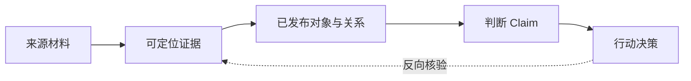

# 个人知识关系系统 PRD

> **版本**：v1.0.0  
> **状态**：待评审  
> **范围**：P0（求职知识域）  
> **更新时间**：2026-07-29  
> **配套文档**：`DEVELOPMENT_PLAN.md`、`docs/architecture/ontology-dictionary.md`、`docs/architecture/relation-dictionary.md`

---

## 1. 先说结论

P0 不做一个“存资料的知识库”，而是做一个帮助单个求职者**形成、核验和更新求职判断**的个人知识关系系统。

用户把职位 JD、项目经历和其他来源材料录入系统后，应能建立并维护以下链路：

系统的价值不在于“替用户判断”，而在于让每个判断都回答得清楚：**依据是什么、依据是否仍有效、变化后哪些结论需要重看。**

---

## 2. 问题、用户与目标

### 2.1 要解决的问题

求职信息通常散落在招聘网站、公司官网、简历、项目材料、聊天记录和临时笔记里。用户会逐步得出“值得投递”“匹配度高”“需要补强某项能力”等判断，但随着资料增加，会出现四个问题：

1. 无法快速找到某个岗位要求或个人能力判断的原始依据。
2. 官方事实、第三方观点、AI 分析与个人判断容易混在一起。
3. JD 更新、来源失效或证据被修正后，旧结论仍可能被继续使用。
4. 把上下文交给外部 AI 时，难以只提供必要、可信且不敏感的信息。

### 2.2 目标用户

P0 面向一名有主动求职需求、愿意维护结构化资料的个人用户。该用户既是资料录入者，也是审核者和决策者；P0 不解决多人协作、招聘方管理或公开社区知识库需求。

### 2.3 P0 目标

| 目标 | 成功状态 |
|---|---|
| 建立可信知识链 | 一条投递决策可追溯到岗位、经历和原始证据。 |
| 降低重复整理成本 | 用户能按对象、关系和证据检索，而非反复翻找原文件。 |
| 让结论可维护 | 上游资料变化后，受影响的判断进入待复核队列。 |
| 让 AI 消费受控 | 外部 AI 只能读取按用途裁剪的已发布上下文。 |
| 验证图查询价值 | 在不影响产品闭环的前提下，评估图投影是否值得长期保留。 |

### 2.4 非目标

- 不自动决定是否投递，也不对公司、岗位或个人能力作“真实性背书”。
- 不把 AI 自动抽取结果直接发布为正式知识。
- 不在 P0 做多用户协作、复杂权限体系、推荐算法、向量检索或公开分享。
- 不把 PDF 解析、批量导入、MCP 接入作为 P0 闭环的前置条件。
- 不将 Neo4j 作为正式知识的写入来源或 P0 可用性的单点依赖。

---

## 3. 产品原则与信息规则

### 3.1 产品原则

1. **先可核验，后自动化**：用户能回到证据，比系统自动给出结论更重要。
2. **先关系，后材料堆积**：材料是来源；岗位、技能、经历与判断之间的关系才是主要消费对象。
3. **先人工审核，后发布**：任何自动或外部输入都只能成为候选项。
4. **保留历史，不覆盖事实**：新 JD、新证据或新判断通过版本与状态表达，不直接抹掉旧记录。
5. **最小披露**：对外只提供完成特定任务所需的已发布信息与证据摘要。

### 3.2 信息分层

| 层级 | 含义 | 例子 | 可否被外部只读接口返回 |
|---|---|---|---|
| 来源材料 | 原始文本、链接或文件及其元数据 | 一份官方 JD | 可按权限返回元信息与必要摘录 |
| 证据 | 可定位到原始材料的片段 | “熟悉 Python 与数据处理” | 可以 |
| 候选知识 | 尚未由用户确认的对象、关系或判断 | 从 JD 抽出的技能 | 不可以 |
| 已发布知识 | 已审核的对象、关系、主张与决策 | 岗位要求 Python | 可以 |
| 判断与决策 | 基于已发布知识形成的结论与行动 | “优先投递” | 可以，且必须说明依据 |

### 3.3 P0 核心对象

| 对象 | 目的 |
|---|---|
| 公司、部门、岗位、JD 版本 | 描述求职目标与其变化。 |
| 技能、个人经历 | 连接岗位要求和个人能力证明。 |
| 来源材料、证据 | 保存每项信息的出处和定位。 |
| 关系 | 表达“岗位要求技能”“经历证明技能”等明确语义。 |
| Claim | 记录事实陈述、来源观点或可解释的推断。 |
| Decision | 记录优先投递、普通投递、暂缓、放弃等行动。 |

### 3.4 不可突破的业务规则

- 已发布关系必须有证据，或明确指向其推导依据；不能只有模糊的 `related_to`。
- `Claim` 必须标明其认识类型：直接事实、来源陈述、推断或个人判断。
- `Decision` 必须至少关联一条 `Claim`；`Claim` 与 `Decision` 的推导链不得成环。
- 候选项、已归档项和未确认来源不得混入正式只读结果。
- 来源不可访问时保留已采集的内容与状态，不把“当前无法访问”误写为“来源不存在”。

### 3.5 发布门禁与影响规则

| 发布项 | 最低门禁 |
|---|---|
| 直接事实关系 | 至少一条可定位 Evidence。 |
| 推导关系 | 至少一条已发布的上游关系或 Claim，且其可达链路最终包含 Evidence；必须记录推导说明。 |
| 直接事实 / 来源陈述 Claim | 至少一条可定位 Evidence。 |
| 推断 Claim | 至少一条已发布的上游对象、关系或 Claim，且可达链路最终包含 Evidence；必须记录推断说明。 |
| 个人判断 Claim | 必须说明判断理由，并至少引用一条已发布 Claim；不把个人偏好伪装成外部事实。 |
| Decision | 至少引用一条已发布 Claim，且该 Claim 的可达链路最终包含 Evidence。 |

以下事件会创建或更新待复核项：

1. 同一来源的新内容与已保存内容不同，创建新的来源/JD 版本；旧版本保留为历史，不再标记为当前。
2. Evidence 被标记为定位失效、来源失效、内容修订，或其关联的已发布关系被废止/修订。
3. 系统从变化项沿 `derived_from`、`based_on` 的下游方向遍历至活跃的 Claim 和 Decision；同一“变化项—受影响项—当前版本”组合只生成一条待复核项。
4. 仅元数据变化（例如标题修正、采集备注）默认不触发复核；用户可手动标记为需复核。

---

## 4. P0 范围与优先级

### 4.1 Must：没有这些就不算完成 P0

| 能力 | 用户可完成的任务 | 验收重点 |
|---|---|---|
| 来源与证据录入 | 保存 JD、经历材料或链接，并标记关键证据片段 | 原文、来源、抓取时间和定位可回看 |
| 候选审核与发布 | 创建、修改、合并、接受或拒绝候选对象/关系 | 候选不能绕过审核成为正式知识 |
| 对象与关系管理 | 维护岗位—技能—经历等语义关系 | 关键关系有类型、状态、证据和历史 |
| 判断与反向追溯 | 从投递决策追到 Claim、关系、证据和来源 | 一条完整链路能在界面中被查看 |
| 版本与影响复核 | 新 JD 或证据失效后识别受影响判断 | 用户能看到原因并完成复核处置 |
| 搜索与渐进浏览 | 搜对象、查看详情、逐层展开关系和证据 | 不需要一次加载全量资料 |
| Context Pack 与只读 API | 为岗位分析导出结构化、最小化的上下文 | 明确区分事实、推断、缺失信息与敏感项 |

### 4.2 Should：不阻塞闭环，但完成后提升可用性

- 将来源文本辅助抽取为候选对象、关系和证据定位。
- 支持关系拓扑图和有限深度的子图浏览。
- 支持 Markdown 格式的 Context Pack（JSON 是 P0 的规范输出）。
- 将已发布知识异步投影到 Neo4j，并实现四类拓扑查询。

### 4.3 延后到 P1 以后

- PDF/OCR、复杂批量导入与浏览器自动采集。
- 多用户、协作审核、团队共享、细粒度权限与公开链接。
- 语义向量检索、自动推荐、自动投递与长期 Agent 工作流。
- MCP 正式对外接入；P0 先以 REST/Context Pack 验证接口边界。

---

## 5. 关键用户场景

### 场景 A：把一份 JD 变成可核验的岗位画像

**触发**：用户看到一个有兴趣的岗位。  
**成功结果**：用户保存原始 JD，确认岗位和技能关系，并能打开每个要求对应的原文证据。

1. 用户录入链接或粘贴 JD，填写来源类型与基础信息。
2. 系统保存原文、采集时间、内容摘要和版本信息。
3. 用户手动创建或审核候选的公司、岗位、技能与关系。
4. 用户为关键关系选择证据片段并发布。
5. 用户在岗位详情中看到已确认要求、证据与最新状态。

### 场景 B：证明“我为什么适合这个岗位”

**触发**：用户准备投递或改简历。  
**成功结果**：用户可将岗位需求与个人经历证据并列查看，形成可解释的匹配判断。

1. 用户录入或选择一段个人项目/实习经历。
2. 用户建立“经历证明技能”的关系，并标出成果、职责或代码等证据。
3. 用户建立“匹配度较高/存在缺口”等 Claim，并连接岗位要求和个人证据。
4. 用户创建投递决策；系统显示该决策依赖的 Claim 与证据链。

### 场景 C：JD 更新后复核原有决定

**触发**：用户发现岗位更新、下线或要求发生变化。  
**成功结果**：系统不覆盖历史版本，而是指出可能失效的判断，用户可确认、修正或废止它们。

1. 用户录入新版本或将旧来源标为失效。
2. 系统识别与该来源、证据、关系有关联的 Claim 和 Decision。
3. 用户在待复核队列查看影响原因与旧/新依据。
4. 用户标记“仍有效”、创建修订版本或废止该判断。

### 场景 D：为外部 AI 准备受控上下文

**触发**：用户想让 AI 协助分析某岗位或改写简历。  
**成功结果**：AI 获得足够回答问题的可信上下文，却不接触候选知识、无关资料或敏感原文。

1. 用户选择用途（如“岗位匹配分析”）与目标岗位。
2. 系统展示将包含的事实、证据摘要、推断、缺失信息和敏感字段提示。
3. 用户确认后导出 JSON 或 Markdown，或经只读 API 获取。
4. AI 的新建议只能作为候选项回流审核。

---

## 6. 功能需求

### 6.1 来源与证据

| 编号 | 要求 | 优先级 |
|---|---|---|
| FR-01 | 用户可新建 URL、粘贴文本和手工录入三类来源；URL 在 P0 中由用户提供并粘贴原文/快照，不做自动抓取；每条来源保存标题、类型、原文/快照、采集时间与访问状态。 | Must |
| FR-02 | 用户可从来源中创建可引用的证据片段，记录摘录、定位、采集时间和来源关联。 | Must |
| FR-03 | 系统对同一来源的相同内容给出重复提示；新内容应作为新版本保存。 | Must |
| FR-04 | 来源访问失败、内容为空或证据定位无效时，给出明确状态和可恢复操作。 | Must |

### 6.2 候选审核与正式发布

| 编号 | 要求 | 优先级 |
|---|---|---|
| FR-05 | 用户可创建或导入候选对象、属性、关系、Claim 与 Evidence；候选必须与正式知识隔离。 | Must |
| FR-06 | 审核工作台需同时展示来源上下文、候选内容、重复匹配、证据门禁和审核动作。 | Must |
| FR-07 | 用户可接受、编辑后接受、拒绝或合并候选；每个动作记录时间、原因和变更前后内容。 | Must |
| FR-08 | 发布前校验对象类型、关系端点、证据要求、状态与无环规则；失败时不得部分发布。 | Must |

### 6.3 关系、判断与决策

| 编号 | 要求 | 优先级 |
|---|---|---|
| FR-09 | 用户可管理公司、部门、岗位、JD 版本、技能、经历、Claim 与 Decision 的详情、状态和历史版本。 | Must |
| FR-10 | 用户可创建并查看有明确语义的关系；核心关系至少包括岗位要求技能、经历证明技能、Claim 依赖关系和 Decision 依据关系。 | Must |
| FR-11 | 系统必须在 Claim 详情中同时展示认识类型、支持/反驳证据、推导依据和新鲜度。 | Must |
| FR-12 | 用户可从 Decision 一键反向追溯至所有可达的 Claim、关系、Evidence 与 Source。 | Must |
| FR-13 | 系统必须以版本与状态表达修订、废止和归档；不提供对正式知识的不可恢复批量删除。 | Must |

### 6.4 搜索、浏览与影响复核

| 编号 | 要求 | 优先级 |
|---|---|---|
| FR-14 | 用户可按对象类型、名称、技能、状态和更新时间搜索已发布知识。 | Must |
| FR-15 | 对象详情按“核心信息 → 关系 → Claim → Evidence → 历史/审计”呈现，并支持有限深度展开。 | Must |
| FR-16 | 当来源、证据或正式关系失效/修订时，系统生成可解释的待复核项，并关联受影响的 Claim/Decision。 | Must |
| FR-17 | 用户可将待复核项处置为仍有效、已修订或已废止；处置必须保留理由。 | Must |
| FR-18 | 关系浏览必须限制深度、节点数和请求时间；超限时提示用户缩小范围。 | Must |

### 6.5 Context Pack 与外部消费

| 编号 | 要求 | 优先级 |
|---|---|---|
| FR-19 | 用户可按用途导出规范 JSON Context Pack，包含已发布事实、证据引用、推断、决策、缺失信息与新鲜度。 | Must |
| FR-20 | Context Pack 不得包含候选知识；默认裁剪无关原文和标记为敏感的信息。 | Must |
| FR-21 | REST 接口仅提供只读查询与受控导出；使用可撤销、可过期的个人访问令牌，记录导出/调用审计；写入和发布仍通过受审核的产品流程完成。 | Must |
| FR-22 | 外部 AI 或脚本产生的新信息必须以 Candidate 身份回流。 | Must |

### 6.6 图查询技术验证（独立于产品闭环）

| 编号 | 要求 | 优先级 |
|---|---|---|
| FR-23 | 已发布知识可异步投影到 Neo4j；投影失败不能影响 PostgreSQL 中的发布事务。 | Should |
| FR-24 | 支持证据反向追溯、技能匹配、影响分析和限定子图四类拓扑查询。 | Should |
| FR-25 | 对至少两类查询提供 PostgreSQL 递归 CTE 与 Cypher 的同口径对照结果。 | Should |
| FR-26 | 图投影可校验、重试、降级和从权威数据全量重建。 | Should |

---

## 7. 页面与交互结构

P0 的界面不追求“全景大图”，而是优先支持在一次任务中读懂一条证据链。

| 页面 | 用户要完成的事 | 关键内容 |
|---|---|---|
| 全局搜索 | 找到岗位、技能、经历或判断 | 搜索、筛选、结果摘要、关系提示 |
| 来源录入 | 保存可复用材料 | 来源内容、版本、访问状态、证据创建 |
| 候选审核 | 把候选项转为可信知识 | 原文对照、候选内容、证据、重复项、审核动作 |
| 对象详情 | 理解一个对象及其关系 | 核心属性、关系分组、Claim、Evidence、版本 |
| 反向追溯 | 验证一个判断或决策 | Decision → Claim → 关系 → Evidence → 来源链路 |
| 待复核队列 | 处理上游变化 | 变化原因、受影响范围、旧新依据、处置动作 |
| Context Pack | 向外提供最小可信上下文 | 用途、范围、敏感项、预览、导出 |

交互要求：

- 每个结论旁必须有“查看依据”入口；证据要能回到来源中的具体位置。
- 所有状态使用明确语义（候选、已发布、待复核、已归档、已废止），避免只使用颜色传达状态。
- 审核、发布、废止和导出前，应让用户看到将发生的影响与不可见边界。
- 图形展示是关系浏览的辅助，列表与路径视图必须可独立完成核心任务。

---

## 8. 成功标准与验收

### 8.1 结果指标

| 指标 | P0 目标 | 说明 |
|---|---|---|
| 决策可追溯率 | 100% | 抽样至少 5 条投递决策，均可回到 Claim、关系、证据和来源。 |
| 关键关系证据覆盖率 | 100% | 岗位要求技能、经历证明技能、推导与决策依据均有证据或清晰上游依据。 |
| 事实与判断区分正确率 | 100% | 抽样至少 50 条，能正确分为事实、来源陈述、推断或个人判断。 |
| 变更影响识别率 | ≥90% | 构造来源失效/JD 修订场景后，能识别受影响的 Claim 与 Decision。 |
| 资料定位效率 | ≥80% | 抽样任务可在“搜索 → 详情 → 关系/证据”三个主要操作内找到目标依据。 |
| Context Pack 可用率 | 5/5 | 在预先定义的五个岗位分析任务中，均不需要直接读库或手工拼接上下文。 |

### 8.2 最小数据集

- 10 家公司、20 个真实岗位、至少 3 个存在多版本 JD 的岗位。
- 25 个标准技能、3 段真实项目或实习经历。
- 50 条正式语义关系与 50 条可定位证据。
- 一个可重复生成的实验数据集（不少于 1,000 个对象、5,000 条关系），仅用于图查询对照。

### 8.3 核心验收用例

| 编号 | Given | When | Then |
|---|---|---|---|
| AC-01 | 已录入一份 JD | 用户发布“岗位要求 Python”关系 | 关系关联可定位的 JD 证据；缺少证据时发布失败。 |
| AC-02 | 存在待审核的候选关系 | 用户未审核即访问正式查询 | 结果中不返回候选关系。 |
| AC-03 | 岗位需求与个人经历均有证据 | 用户创建“匹配度较高”Claim 和投递决策 | 可从决策完整追溯到两侧证据。 |
| AC-04 | 已保存 JD v1 与基于它的决策 | 用户录入 JD v2 或标记 v1 失效 | 历史不被覆盖，相关决策进入待复核。 |
| AC-05 | 两条同类型技能候选指向同一正式技能 | 用户选择合并 | 不产生重复正式对象，保留合并记录与历史。 |
| AC-06 | 用户导出岗位分析 Context Pack | 预览并导出 | 输出为规范 JSON，不含候选项，区分事实/推断/缺失信息并裁剪敏感字段。 |
| AC-07 | 用户搜索一个已发布岗位 | 从结果打开详情并展开“岗位要求技能”关系 | 在三次主要操作内看到关系及其 Evidence。 |
| AC-08 | 外部脚本持有有效个人访问令牌 | 调用只读接口或导出 Context Pack | 仅返回已发布且经裁剪的数据，并记录调用审计；令牌撤销后请求失败。 |

### 8.4 独立技术实验验收（不阻塞 P0 产品闭环）

| 编号 | Given | When | Then |
|---|---|---|---|
| EXP-01 | Neo4j 投影不可用 | 用户发布正式知识 | PostgreSQL 发布、审计和基础查询成功；系统标记投影降级。 |
| EXP-02 | 图数据库可用且投影已追平 | 用户执行限定关系类型与深度的查询 | 返回的关系、版本和 Evidence 引用与权威数据一致。 |
| EXP-03 | 固定数据集与同口径查询 | 分别执行递归 CTE 与 Cypher 查询 | 产出正确性、P50/P95、结果规模、表达复杂度与维护成本的对照报告。 |

---

## 9. 技术与数据边界

本节只定义产品必须遵守的约束；表结构、接口字段、Mapping 和基准方法以配套技术文档为准。

1. **PostgreSQL 是唯一权威源**：正式知识、版本、状态、审计、任务与证据由它决定。
2. **Neo4j 是可重建查询投影**：仅接收已发布知识的异步投影；不可用时，系统回退到 PostgreSQL 查询。
3. **发布必须原子化**：领域校验、正式状态更新、审计记录和投影事件要么一起成功，要么都不生效。
4. **长任务可见且可恢复**：使用可查询状态的任务记录；失败可重试，但不能绕过审核或制造部分发布。
5. **默认私有**：个人经历、偏好与未公开资料不对外开放；日志不记录凭据和大段敏感原文。
6. **实验服务于决策**：若图查询的表达收益、性能或维护成本不成立，可删除 Neo4j 而不影响 P0 产品闭环。

---

## 10. 交付节奏与文档分工

| 阶段 | 产品出口 | 不在 PRD 中展开的交付 |
|---|---|---|
| M0：模型定版 | 对象、关系、状态、证据规则和核心场景达成一致 | Ontology/关系字典、API 契约 |
| M1：可信录入 | 来源、Evidence、Candidate、审核和发布可运行 | Schema、迁移、领域测试 |
| M2：核验闭环 | 关系、Claim、Decision、追溯、版本和复核可用 | 查询实现、审计与回归测试 |
| M3：受控消费 | 搜索、Context Pack、只读 API 可用 | 接口文档、安全测试 |
| M4：图论证 | 图投影、对照查询和是否保留 Neo4j 的结论 | Mapping、数据集、基准与实验报告 |

### 配套文档的职责

- `docs/architecture/ontology-dictionary.md`：对象、属性、状态与生命周期。
- `docs/architecture/relation-dictionary.md`：关系类型、端点、证据与无环约束。
- `docs/architecture/ADR-0001-modular-monolith-and-graph-projection.md`：架构决策与降级边界。
- `docs/experiments/topology-benchmark-plan.md`：数据集、查询口径、性能与可维护性对照方法。
- `DEVELOPMENT_PLAN.md`：里程碑、工程任务、质量门禁与实施顺序。

---

## 11. 评审时需要确认的决策

1. 是否确认 P0 只服务单个用户，并把多人协作全部移出本期？
2. 是否确认“人工录入 + 审核”是 P0 的必经路径，AI 抽取仅作为可插拔增强？
3. 是否确认 Neo4j 以实验性 Should 项存在，最终允许得到“不保留”的结论？
4. 是否确认 Context Pack 先以 REST/导出验证，MCP 延后？
5. 是否确认本 PRD 的 Must 范围是 P0 的唯一产品验收范围，表结构、接口细节和基准脚本移交配套文档维护？

